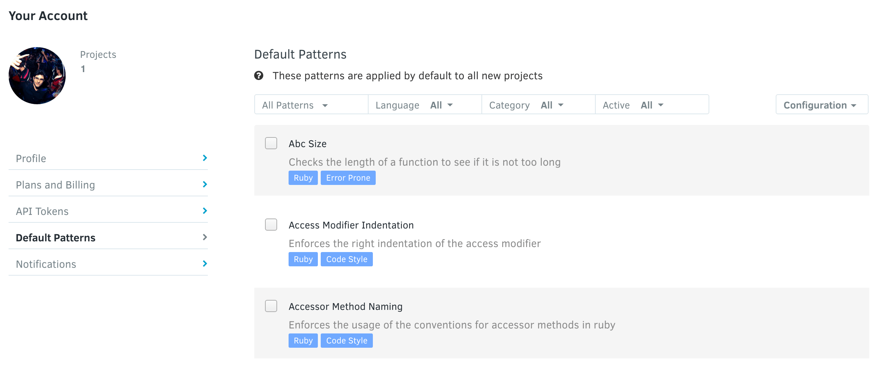
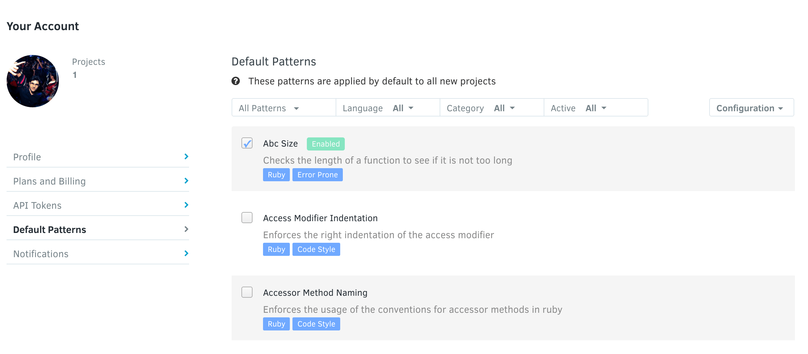
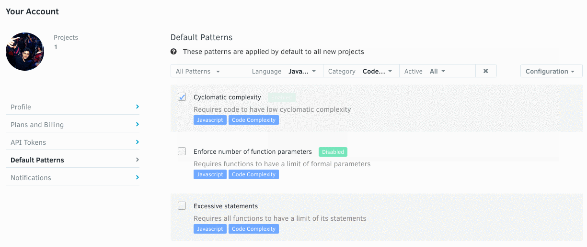

# Default Patterns

When you register a repository without having set your own default patterns, Codacy will apply a subset of the existing patterns to the repository. The patterns enabled by default are chosen according to community feedback or previously approved existing coding standards.

You can change the default list of patterns, creating a unique coding standard that is applied automatically to any repository that you register. After repository registration, any change to the list of patterns in the Repository settings will only be applied to that specific repository, allowing you to completely customize any repository to suit whatever coding standard you deem appropriate.

To do this, click on your avatar, **Your Account**, and open **Default Patterns**.

To add or remove a pattern from the list of default patterns, use the checkbox next to the pattern name. You will be provided with feedback:

To navigate through the issues, you can use the available filters. Allowing you to search the issues you feel are more suited for your repository:

