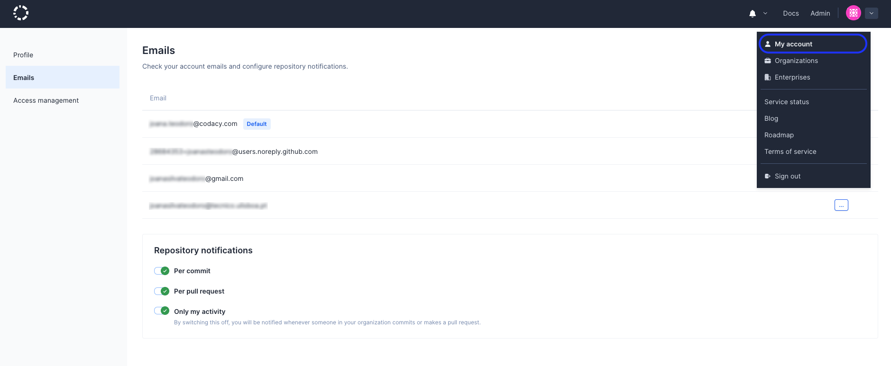

## Emails

This is not an issue.

To manage the email addresses associated with your account and your email notifications, click on your avatar on the top right-hand corner, select **Your account**, and open the **Emails** page.

## Managing your email notifications

Codacy can send you an email whenever there are new analysis results on your repositories with the list of found issues and the changes that created them. Codacy sends all email notifications to your default email address, and you can change your default email address by clicking **make default** next to another email address.

Configure the notifications that you wish to receive under **Repository notifications**:

-   **Per commit:** Codacy will send you an email for each analyzed commit.

-   **Per pull request:** Codacy will send you an email for each analyzed pull request.

-   **Only my activity:** By default, Codacy will only sends you emails about your own commits and pull requests. Turn off this setting to receive emails for commits and pull requests made by other people as well.

To further customize these settings for a specific repository, select the repository and configure which notifications to receive for commits and pull requests made in that repository.

The example above enables notifications for:
    
-   My pull requests in all repositories 
-   Everyone's commits in the repository scala-tests only 

!!! tip
    To turn off all email notifications, disable the global settings **Per commit** and **Per pull request** and remove all custom settings for specific repositories.

# Trigger an issue

## See also

-   [How do I change my email address on Codacy?](../faq/general/how-do-i-change-my-email-address-on-codacy.md)
