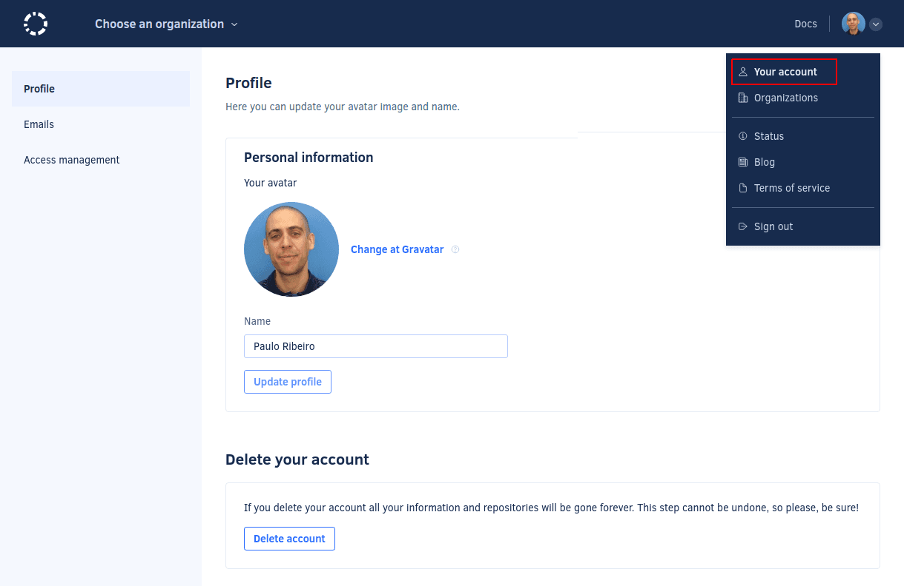

# Managing your profile

To manage your profile information such as your name and avatar, click on your avatar on the top right-hand corner and select **Your account**.

## Changing your name or username

To change your name or username, update the fields **Name** or **Username** and click the button **Update profile**.

## Changing your avatar

To change your avatar, sign up or log in at [Gravatar](https://en.gravatar.com/) using the same email address that you used to log into Codacy. The avatar that you define there will be automatically used as your avatar on Codacy.

!!! note
    Organization avatars aren't editable at the moment.

## Deleting your account

When you delete your account on Codacy, your profile and information about your personal repositories will be completely removed from Codacy.

To delete your account, click the button **Delete account** and confirm that you really want to proceed.

!!! note
    If you're the last organization owner of any of your organizations, you must either add someone else as an owner or [delete those organizations](../organizations/what-are-synced-organizations.md#deleting-an-organization) before you can delete your account.
