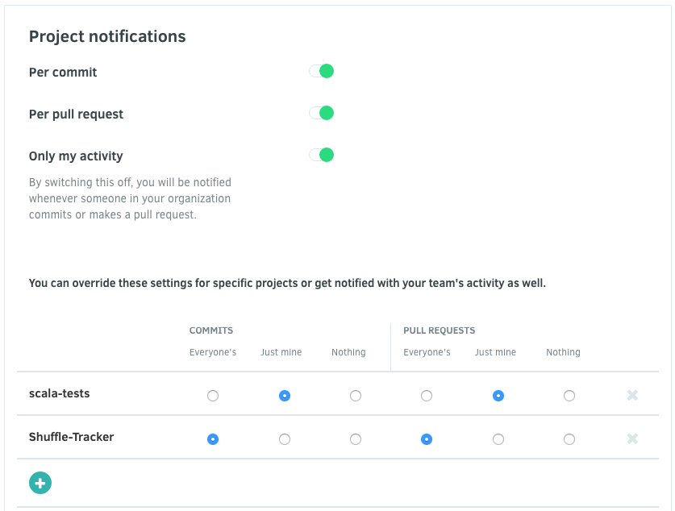

# Notifications

You can configure which repositories you want to be emailed about and your default email address to receive the notifications. When new results are found, Codacy will email you regarding the issues found and the changes that created them.

To change these settings click on your avatar, **Your Account**, and open **Notifications**.

To disable all repository notifications, you can either remove all repositories or remove both commit and pull request notifications globally.
