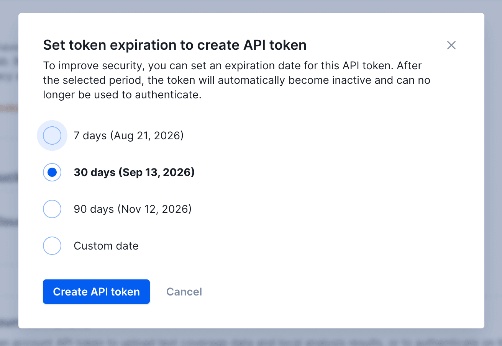
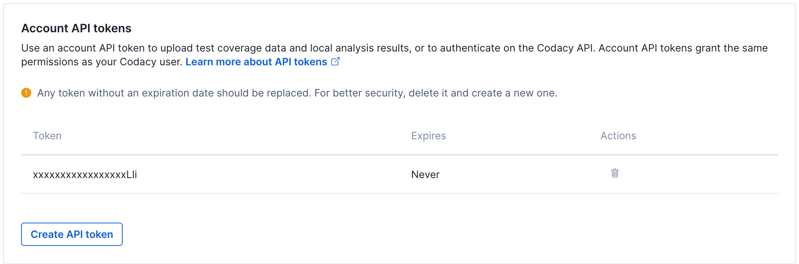
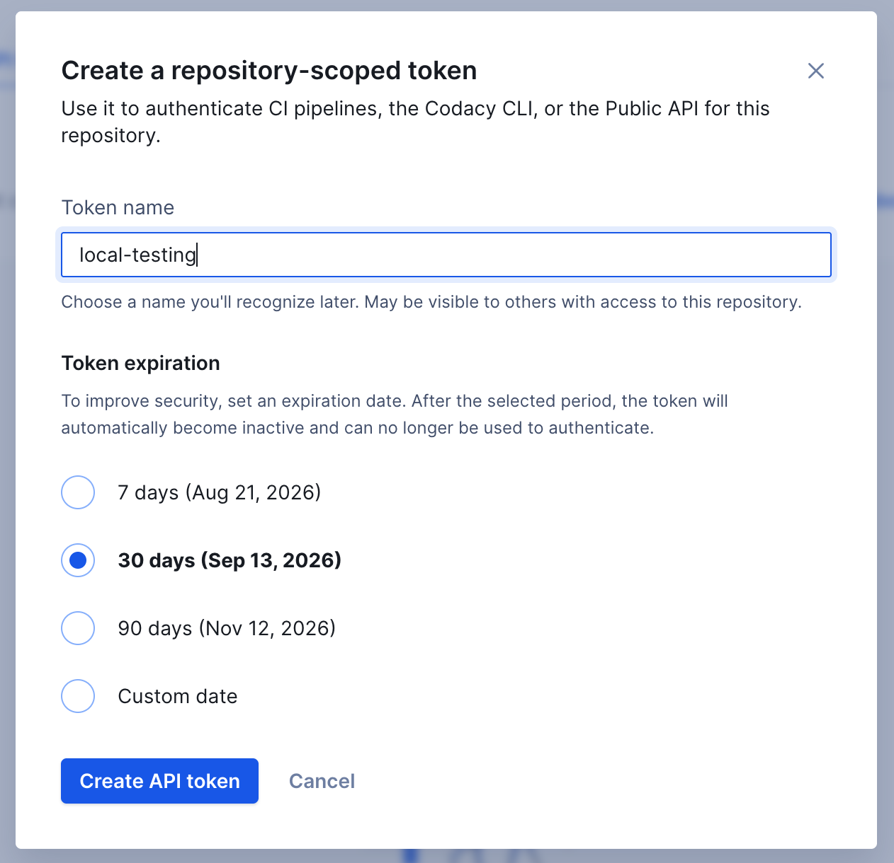
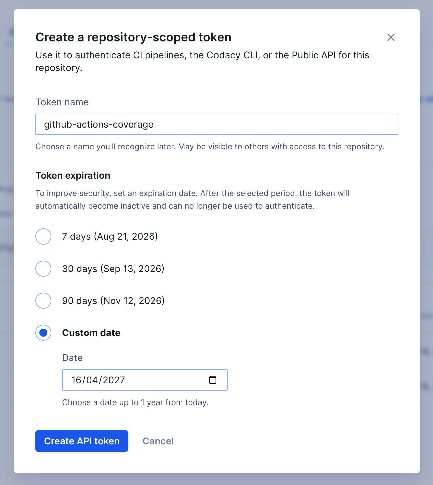
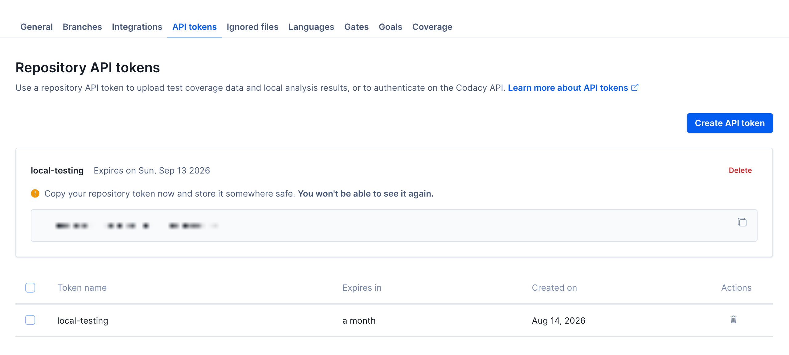
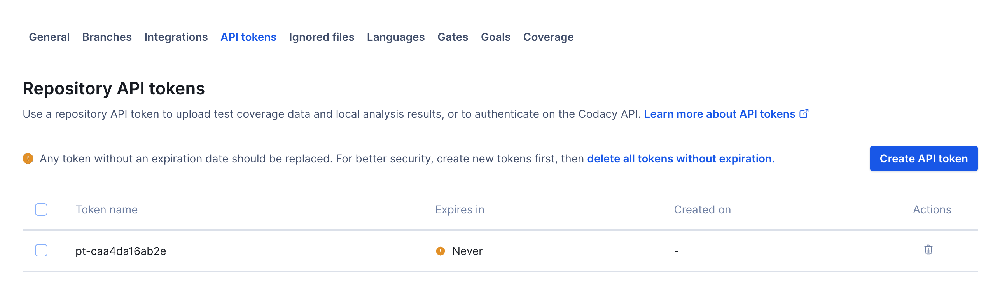
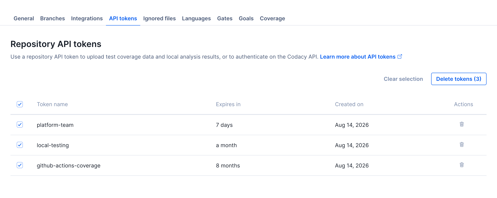

# API tokens

Codacy provides **account** and **repository**-level API tokens that allow you to:

-   [Upload coverage data](../coverage-reporter/index.md) to Codacy
-   Upload to Codacy the results of [running client-side analysis tools](../repositories-configure/local-analysis/client-side-tools.md)
-   [Authenticate when using the Codacy API](using-the-codacy-api.md#authenticating-requests)
-   [Authenticate with the Codacy Cloud CLI](../codacy-cloud-cli/index.md#authentication)

The sections below provide details about the two types of API tokens and instructions on how to generate and revoke them.



## Generating and revoking account API tokens {: id="account-api-tokens"}

Account API tokens are defined at the **Codacy user account level**. Each account API token authorizes access to the same organizations, repositories, and operations as the [roles and permissions of the owner of the account](../organizations/roles-and-permissions-for-organizations.md).

!!! important
    **If you're using an account API token to upload coverage** be sure to [check the roles](../organizations/roles-and-permissions-for-organizations.md) that your Git provider account must have to authorize uploading coverage to Codacy.

    Use a dedicated service account to integrate Codacy with your repositories. This prevents disruption of service if the user who created an account API token loses access to the repositories, which may happen when a user leaves the team or the organization.

You can create new account API tokens programmatically [using the Codacy API](examples/creating-repository-api-tokens-programmatically.md) or using the Codacy UI:

1.  Open your account, tab **Access management**.

1.  Click the button **Create API token** under **Account API tokens**.

1.  Select an expiration date from the modal options. You can select 7, 30, or 90 days, or set a custom date up to a maximum of one year from creation.

    

!!! tip
    You can create multiple account API tokens. This can be useful to have a more flexible control by revoking only a specific token.

When you have tokens created, you can view them inside the tokens table. By hovering a token, you are able to copy its value.

To delete an account API token, click the trash icon in the Actions column of the table. After this, all applications or services using that token to access the Codacy API will fail to authenticate and will receive the reply `{"error":"not found"}`.

Account API tokens created before expiration dates became mandatory still work, and appear in the table with the expiration set as **Never**. Codacy recommends replacing them: create a new account API token with an expiration date, update every application or service that authenticates with the old token, and only then delete the token without an expiration date. Creating the replacement first prevents the applications still using the old token from failing to authenticate.

## Generating and revoking repository API tokens {: id="repository-api-tokens"}

Repository API tokens are defined on **individual repositories**. Each repository API token only authorizes access to the corresponding repository — it can't be used to access any other repository or organization data. On **API v3**, it's further restricted to the [operations listed below](#repository-api-token-operations); on the legacy **API v2**, a repository API token has full access to that repository's endpoints, with no such restriction.

You can create new repository API tokens programmatically [using the Codacy API](examples/creating-repository-api-tokens-programmatically.md) or using the Codacy UI:

1.  Open your repository **Settings**, tab **API tokens**.

1.  Click the button **Create API token** under **Repository API tokens**.

    -   Optionally give the token a name. Names may contain only letters, numbers, and dashes, up to 100 characters, and must be unique within the repository. If you don't set a name, Codacy generates one for you.
    -   Select an expiration date for the token. Repository API tokens must always have an expiration date, up to a maximum of one year from creation — there's no option to create a token that never expires.

    !!! tip
        You can create multiple (up to 100) API tokens per repository. This can be useful to have a more flexible control by revoking only a specific token.

    

    Selecting **Custom date** lets you pick any date up to one year from today:

    

Codacy displays the value of the new token **only once**, immediately after you create it. Copy it and store it somewhere safe before leaving the page — you won't be able to see it again. From then on, the tokens table shows only the name, expiration, and creation date of each token.

!!! note
    Repository API tokens created before expiration dates became mandatory still work, and appear in the table with the expiration set as **Never**. Codacy recommends replacing them: create a new repository API token with an expiration date, update every application or service that authenticates with the old token, such as your CI pipelines, and only then delete the old tokens. You can delete them individually, or all at once using the **delete all tokens without expiration** shortcut in the banner.

When a repository API token expires, requests authenticated with it are rejected with a distinct "token expired" error, so you can tell an expired token apart from one that's invalid or was deleted.

To revoke a repository API token, click the trash icon in the **Actions** column of the table. To revoke several tokens at once, select them using the checkboxes and click **Delete tokens**:

After this, all applications or services using those tokens to access the Codacy API will fail to authenticate and will receive the reply `{"error":"not found"}`.

### What repository API tokens can do on API v3 {: id="repository-api-token-operations"}

On **API v3**, a repository API token authorizes only the following operations, and only on the repository it was created for. This restriction doesn't apply to **API v2**, where a repository API token can access any endpoint for its repository:

-   [Get a repository](https://api.codacy.com/api/api-docs#getrepository)
-   [Get a repository with analysis information](https://api.codacy.com/api/api-docs#getrepositorywithanalysis)
-   [Get the analysis tools settings of a repository](https://api.codacy.com/api/api-docs#listrepositorytools)
-   [Configure an analysis tool for a repository](https://api.codacy.com/api/api-docs#configuretool)
-   [Get the patterns configuration for a tool in a repository](https://api.codacy.com/api/api-docs#listrepositorytoolpatterns)
-   [Update the patterns configuration for a tool in a repository](https://api.codacy.com/api/api-docs#updaterepositorytoolpatterns)
-   [Get the patterns overview for a tool in a repository](https://api.codacy.com/api/api-docs#toolpatternsoverview)
-   [Get the languages settings of a repository](https://api.codacy.com/api/api-docs#getrepositorylanguages)
-   [List issues in a repository](https://api.codacy.com/api/api-docs#searchrepositoryissues)
-   [Get an overview of the issues in a repository](https://api.codacy.com/api/api-docs#issuesoverview)
-   [Return analysis results for the commits in a branch](https://api.codacy.com/api/api-docs#listrepositorycommits)
-   [Reanalyze a specific commit in a repository](https://api.codacy.com/api/api-docs#reanalyzecommitbyid)
-   [List ignored files in a repository](https://api.codacy.com/api/api-docs#listignoredfiles)

For any other endpoint, including creating, listing, or revoking API tokens themselves, use an [account API token](#account-api-tokens) instead.

## See also

-   [Adding coverage to your repository](../coverage-reporter/index.md)
-   [Client-side tools](../repositories-configure/local-analysis/client-side-tools.md)
-   [Creating repository API tokens programmatically](examples/creating-repository-api-tokens-programmatically.md)
