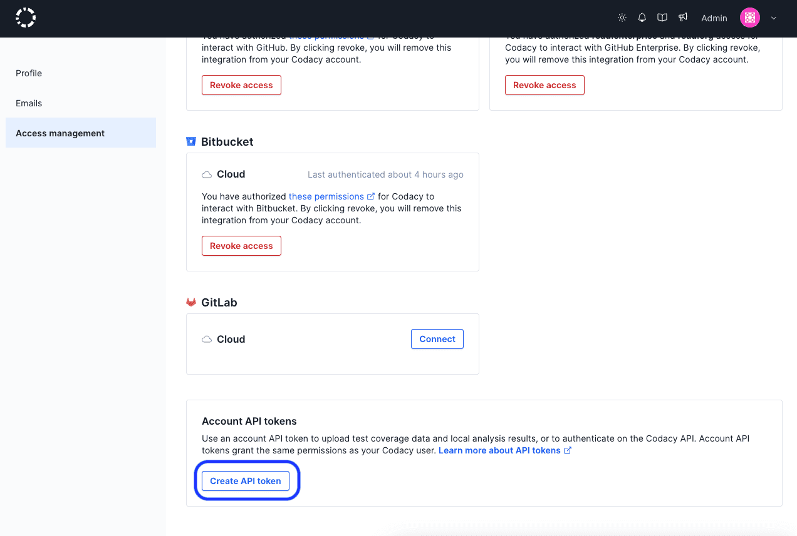

# API tokens

Codacy provides **account** and **project**-level API tokens that allow you to:

-   [Upload coverage data](../coverage-reporter/index.md) to Codacy
-   [Upload the results of running local analysis](../related-tools/local-analysis/running-local-analysis.md) to Codacy
-   [Authenticate when using the Codacy API](using-the-codacy-api.md#authenticating-requests)

The sections below provide details about the two types of API tokens and instructions on how to generate and revoke them.



## Generating and revoking account API tokens {: id="account-api-tokens"}

Account API tokens are defined at the **Codacy user account level**. Each account API token authorizes access to the same organizations, repositories, and operations as the [roles and permissions of the owner of the account](../organizations/roles-and-permissions-for-organizations.md).

!!! important
    **If you're using an account API token to upload coverage** be sure to [check the roles](../organizations/roles-and-permissions-for-organizations.md) that your Git provider account must have to authorize uploading coverage to Codacy.

    We recommend that you use a dedicated service account for integrating Codacy with your repositories. This will avoid disruption of service if the user who originally created an account API token stops having access to the repositories, such as when the user leaves the team or the organization.

You can create new account API tokens programmatically [using the Codacy API](examples/creating-project-api-tokens-programmatically.md) or using the Codacy UI:

1.  Open your account, tab **Access management**.

1.  Click the button **Create API token** under **Account API tokens**.

    !!! tip
        You can create multiple account API tokens. This can be useful to have a more flexible control by revoking only a specific token.

    

To revoke an account API token, click the "X" next to the token. After this, all applications or services using that token to access the Codacy API will fail to authenticate and will receive the reply `{"error":"not found"}`.

## Generating and revoking project API tokens {: id="project-api-tokens"}

Project API tokens are defined on **individual repositories**. Each project API token only authorizes access to the corresponding repository.

You can create new project API tokens programmatically [using the Codacy API](examples/creating-project-api-tokens-programmatically.md) or using the Codacy UI:

1.  Open your repository **Settings**, tab **Integrations**.

1.  Click the button **Add integration** and add a **Project API** integration.

1.  Click the button **Settings** on the **Project API** integration and copy the project API token.

    !!! tip
        You can create multiple (up to 100) project API tokens per repository. This can be useful to have a more flexible control by revoking only a specific token.

    

To revoke a project API token, click the trash can icon for the corresponding **Project API** integration. After this, all applications or services using that token to access the Codacy API will fail to authenticate and will receive the reply `{"error":"not found"}`.

## See also

-   [Adding coverage to your repository](../coverage-reporter/index.md)
-   [Running local analysis](../related-tools/local-analysis/running-local-analysis.md)
-   [Client-side tools](../related-tools/local-analysis/client-side-tools.md)
-   [Creating project API tokens programmatically](examples/creating-project-api-tokens-programmatically.md)
