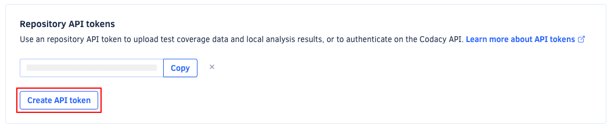

# API tokens

Codacy provides **account** and **repository**-level API tokens that allow you to:<!--TODO CY-6642 Replace project by repository-->

-   [Upload coverage data](../coverage-reporter/index.md) to Codacy
-   Upload to Codacy the results of [running client-side analysis tools](../repositories-configure/local-analysis/client-side-tools.md)
-   [Authenticate when using the Codacy API](using-the-codacy-api.md#authenticating-requests)

The sections below provide details about the two types of API tokens and instructions on how to generate and revoke them.



## Generating and revoking account API tokens {: id="account-api-tokens"}

Account API tokens are defined at the **Codacy user account level**. Each account API token authorizes access to the same organizations, repositories, and operations as the [roles and permissions of the owner of the account](../organizations/roles-and-permissions-for-organizations.md).

!!! important
    **If you're using an account API token to upload coverage** be sure to [check the roles](../organizations/roles-and-permissions-for-organizations.md) that your Git provider account must have to authorize uploading coverage to Codacy.

    Use a dedicated service account to integrate Codacy with your repositories. This prevents disruption of service if the user who created an account API token loses access to the repositories, which may happen when a user leaves the team or the organization.

You can create new account API tokens programmatically [using the Codacy API](examples/creating-repository-api-tokens-programmatically.md) or using the Codacy UI:

1.  Open your account, tab **Access management**.

1.  Click the button **Create API token** under **Account API tokens**.

    !!! tip
        You can create multiple account API tokens. This can be useful to have a more flexible control by revoking only a specific token.

    

To revoke an account API token, click the "X" next to the token. After this, all applications or services using that token to access the Codacy API will fail to authenticate and will receive the reply `{"error":"not found"}`.

## Generating and revoking repository API tokens {: id="project-api-tokens"}

<!--TODO CY-6642 Replace project by repository-->

Repository API tokens are defined on **individual repositories**. Each repository API token only authorizes access to the corresponding repository.

You can create new repository API tokens programmatically [using the Codacy API](examples/creating-repository-api-tokens-programmatically.md) or using the Codacy UI:

1.  Open your repository **Settings**, tab **Integrations**.

1.  Click the button **Create API token** under **Repository API tokens**.

    !!! tip
        You can create multiple (up to 100) API tokens per repository. This can be useful to have a more flexible control by revoking only a specific token.

    <!--TODO CY-6642 Update screenshot-->

To revoke a repository API token, click the "X" next to the token. After this, all applications or services using that token to access the Codacy API will fail to authenticate and will receive the reply `{"error":"not found"}`.

## See also

-   [Adding coverage to your repository](../coverage-reporter/index.md)
-   [Client-side tools](../repositories-configure/local-analysis/client-side-tools.md)
-   [Creating repository API tokens programmatically](examples/creating-repository-api-tokens-programmatically.md)<!--TODO CY-6642 Update page name-->
