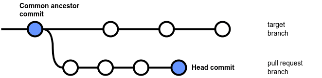

# Identifying commits without coverage data

To calculate the supported coverage metrics for pull requests, Codacy requires that at least the following commits provide coverage data:

-   The common ancestor commit of the pull request branch and the target branch
-   The head commit of the pull request branch

The following diagram highlights the commits that must have received coverage data for Codacy to display the coverage variation metric on a pull request:



However, different factors may prevent your setup from correctly reporting coverage data for the required commits.

To check if Codacy has received the required coverage data to calculate the coverage metrics for a pull request, use the Codacy API endpoint [getPullRequestCoverageReports](https://api.codacy.com/api/api-docs#getpullrequestcoveragereports).

## Example: Identifying which pull request commits are missing coverage data

<!--TODO Explain example-->

```bash
CODACY_API_TOKEN="<your account API token>"
GIT_PROVIDER="<your Git provider>" # gh, ghe, gl, gle, bb, or bbe
ORGANIZATION="<your organization name>"
REPOSITORY=$1

check_pull_request() {
  curl -sX GET "https://app.codacy.com/api/v3/analysis/organizations/$GIT_PROVIDER/$ORGANIZATION/repositories/$REPOSITORY/pull-requests/$1/coverage/status" \
       -H "api-token: $CODACY_API_TOKEN" \
       -H "Content-Type: application/json" \
  | jq -r '.data[] | "Coverage for \(.commitSha) is \(.reports[0].status)"'
}

curl -sX GET "https://app.codacy.com/api/v3/analysis/organizations/$GIT_PROVIDER/$ORGANIZATION/repositories/$REPOSITORY/pull-requests" \
     -H "api-token: $CODACY_API_TOKEN" \
     -H "Content-Type: application/json" \
| jq -r ".data[] | .pullRequest.number" | \

while read pr; do
    echo "Checking #$pr"
    check_pull_request $pr
done
```

Example output:

```bash
$ ./check-coverage.sh pulse
Checking #1563
Coverage for 4faccc86676f7dba3af2b71400605b0be4a686e3 is Processed
Coverage for 51e57784468459b9b2839aa63c3e7e807a39c4ab is null
Checking #1481
Coverage for 6d6a3ec0c773fb016a7302f8111c185a34e1a9b2 is null
Coverage for 4015f987fab77d41dc27ec3100b57fa58bef4559 is Processed
Checking #1434
Coverage for 74efe5d7542846f36cb8c030bd6b73fa9060dca2 is null
Coverage for 1a64ea8885717e7b9874c9f3702806ec96b00276 is null
```
