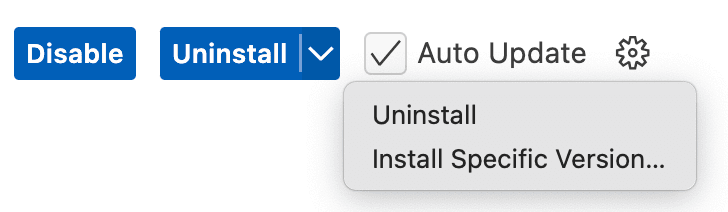

# FAQs

## How do I install Codacy Guardrails?
Please have a look at our [documentation](codacy-guardrails-getting-started.md)

## Does Guardrails only work with AI-generated code?
No. While Guardrails does scan and autofix AI code as part of the agent flow, it scans any code shown in your IDE in real-time, regardless of how it was written.

## How's Guardrails different from Codacy’s traditional analysis?
Guardrails is IDE-first and real-time. It complements Codacy’s platform analysis by catching issues earlier in the development cycle.

## Does Guardrails work offline?
Yes, local scanning via Codacy CLI works offline. API-based features (like querying metrics) require connectivity.

## Which AI security and quality standards can I enforce with Guardrails?
Codacy Guardrails detects and autoremediate security risks and quality issues in JavaScript, TypeScript, Python, and Java, including:


-  SAST vulnerabilities
-  Hardcoded secrets
-  Insecure dependencies
-  Error prone code
-  Performance issues
-  Best practices
-  Complex code
-  Code duplications
-  Styling violations

Configuring and enforcing coding standards at scale across all IDEs in your organization requires a Codacy Team or Business subscription.

## Is my data secure?
Codacy Guardrails isn't a large language model, but an IDE extension that uses an MCP Server to communicate with existing AI coding agents owned by the user.

## When I change some analysis configuration in the UI, is it automatically applied to Guardrails?
We're still working on this feature but in order to update the new tool configuration. you should run the command in your repository:

``` bash
codacy-cli init
```

This way Codacy will run the latest configuration.

## Does guardrails generate code for me?
Guardrails Specify that Guardrails itself doesn’t generated anything but we inform the AI agent where issues are located and scan generated code using the Codacy CLI.

## How much does Guardrails cost?
Codacy Guardrails is a free IDE Extension for local scanning of AI-generated and human-written code, **available free of charge to all developers.**

Check our [Team and Organization plans](https://www.codacy.com/pricing) to unlock:


-  Central configuration and enforcement of AI coding standards across teams and projects
-  Query and autofix existing problems across your codebase from the AI chat panel
-  Generate custom security and code quality reports using AI prompts
-  Full access to the Codacy Cloud platform including:

-   Pipeline-less AppSec and code quality scans
-   PR merge gates
-   Team dashboards
-   Security reports
-   DAST pipelines
-   Jira integration

## Does Guardrails work with all OS?
Guardrails is supported on MacOS, Linux, and Windows (via [WSL](https://learn.microsoft.com/en-us/windows/wsl/install))

## Can I use Guardrails without an AI copilot?
Codacy Guardrails is designed to be installed from our IDE extension for VS Code, Cursor and Windsurf, but as long as you have an AI code generator that's compatible with the MCP protocol you can also add Guardrails into your MCP configuration manually.

Without an AI coding agent, you can still use the IDE extension for local analysis and PR check information.

## How can I install a specific version of the IDE extension?
1. Open the Extensions tab
2. Select `Codacy`
3. Click on the down arrow on the right of the Uninstall button
4. Select `Install specific version...`
   
5. Select the version you want on the top search bar
6. Click on `Restart Extensions` when that button appears

Keep in mind that the IDE extension is under active development, so be sure to check for updates regularly. Reverting to the latest version is as simple as clicking on **Update**.
