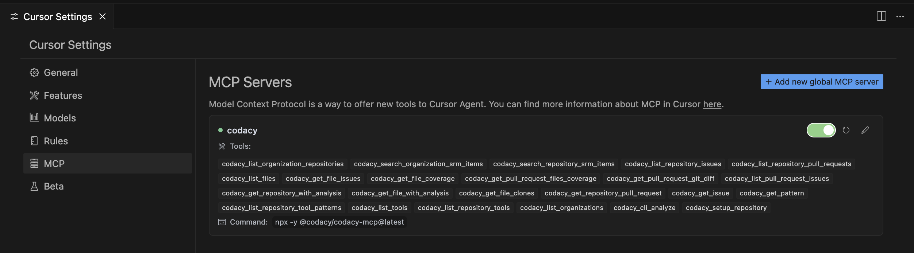

# Getting Started

Codacy Guardrails is a brand new way of enforcing code security and quality standards for AI-generated code, built into the free Codacy IDE Extension for VSCode, Copilot, Cursor, and Windsurf. Guardrails help developers ship safer, cleaner AI code by applying best practices and blocking insecure patterns while the code is being generated.

Besides real-time AI code scanning, Guardrails users can now prompt all their Codacy findings, without ever leaving the AI chat panel inside their IDE.

**New to Codacy Guardrails?**

<iframe width="560" height="315" src="https://www.youtube.com/embed/uVyRWnnJu-0?si=Pnbk65EvpvvJRXX4" title="YouTube video player" frameborder="0" allow="accelerometer; autoplay; clipboard-write; encrypted-media; gyroscope; picture-in-picture; web-share" referrerpolicy="strict-origin-when-cross-origin" allowfullscreen></iframe>

[Check our blog post](https://blog.codacy.com/codacy-guardrails-free-real-time-enforcement-of-security-and-quality-standards)

## Prerequisites

### Supported Operating Systems

- macOS
- Linux
- Windows (Coming Soon)

!!! important 
    **For Windows users: Windows WSL** (a feature that allows you to run a Linux environment directly on Windows, without the need for a virtual machine or dual-boot setup) is the only way you can use this feature for now, but we're still working to fully support Windows.

### Supported IDEs

- Visual Studio Code
- Cursor
- Windsurf

### Supported tools

- ESLint
- Trivy
- Pylint
- PMD
- DartAnalyzer
- Semgrep
- Lizard (Read about this tool [here](https://docs.codacy.com/release-notes/cloud/cloud-2025-02-adding-ruff-lizard/#lizard))

## How to install the Codacy Extension

### 1.  Download the extension

- [Visual Studio Code](https://tinyurl.com/codacy-vscode)
- [Cursor](http://tinyurl.com/codacy-cursor)
- [Windsurf](http://tinyurl.com/codacy-windsurf)

Click on the button **Install** below Codacy icon

### 2. Activate the Codacy CLI for local analysis

Click on the button **Install Codacy CLI**

It will create a folder in your local repository called **.codacy** with the app already installed

### 3. Install MCP Server (check the next topic in this page)

### 4. Restart your IDE

## How to install MCP Server
[Check the README file of this feature](https://github.com/codacy/codacy-mcp-server/blob/master/README.md)

### 1. Add the Codacy MCP Server

Click on the button **Add Codacy MCP Server**

### 2. Restart the IDE

### 3. Check if the Codacy MCP Server is enabled

It should be all **green** without any **error message**

