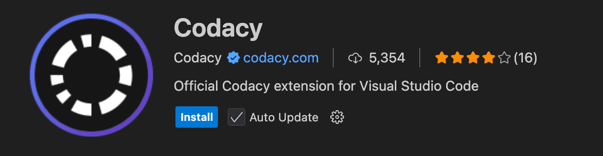
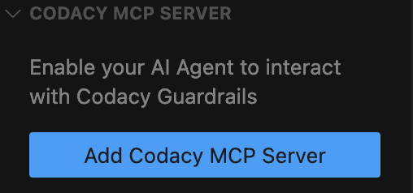
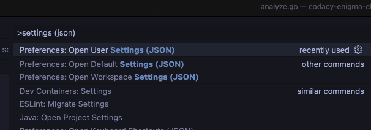

# Getting Started

Codacy Guardrails is a brand new way of enforcing code security and quality standards for AI-generated code, built into the free Codacy IDE Extension for VSCode, Copilot, Cursor, and Windsurf. Guardrails help developers ship safer, cleaner AI code by applying best practices and blocking insecure patterns while the code is being generated.

Besides real-time AI code scanning, Guardrails users can now prompt all their Codacy findings, without ever leaving the AI chat panel inside their IDE.

**New to Codacy Guardrails?** [Check our blog post](https://blog.codacy.com/codacy-guardrails-free-real-time-enforcement-of-security-and-quality-standards)

<iframe width="560" height="315" src="https://www.youtube.com/embed/uVyRWnnJu-0?si=Pnbk65EvpvvJRXX4" title="YouTube video player" frameborder="0" allow="accelerometer; autoplay; clipboard-write; encrypted-media; gyroscope; picture-in-picture; web-share" referrerpolicy="strict-origin-when-cross-origin" allowfullscreen></iframe>


## Prerequisites

- git
- node.js - ensure the `npx` commands runs without issues

### Supported Operating Systems

- macOS
- Linux
- Windows (Coming Soon)

!!! important
    **For Windows users: Windows WSL** (a feature that allows you to run a Linux environment directly on Windows, without the need for a virtual machine or dual-boot setup) is the only way you can use this feature for now, but we're still working to fully support Windows.


### Supported IDEs

- Visual Studio Code
- Cursor
- Windsurf

!!! note
    Visual Studio Code Insiders is recommended for its faster performance and compatibility with Codacy Guardrails. However, since it's a beta version, you may encounter occasional issues.

### Built-in Scanners

- Trivy
- Semgrep
- ESLint
- Pylint
- PMD
- dartanalyzer
- [Lizard](https://docs.codacy.com/release-notes/cloud/cloud-2025-02-adding-ruff-lizard/#lizard)

## How to install - Quick Guide

### 1.  Download the extension

- [Visual Studio Code](https://tinyurl.com/codacy-vscode)
- [Cursor](http://tinyurl.com/codacy-cursor)
- [Windsurf](http://tinyurl.com/codacy-windsurf)

This will open the Codacy Extension in your IDE Marketplace. Click **Install**




### 2. Install and activate the Codacy CLI for local analysis

Click on the button **Install Codacy CLI**


It will create a folder in your local repository called **.codacy** with all needed configuration:

-  The configuration from all built-in scanners
-  Codacy CLI script to run analysis locally 

!!! note
    If you don't want this folder to be part of your repository in future commits but continue working with it locally, please add **.codacy** to your .gitignore file


### 3. Install MCP Server

#### a. Add the Codacy MCP Server

In the Codacy Extension tab, click **Add Codacy MCP Server**



#### b. Check if the Codacy MCP Server is enabled

On the left side menu of the Codacy extension, please make sure that MCP server is set up and ready.


### 4. Restart your IDE


## How to install - Manually

### 1.  Install and activate the Codacy CLI for local analysis {: id="install-cli"}

#### Download

##### MacOS (brew)

To install `codacy-cli` using Homebrew:

```bash
brew install codacy/codacy-cli-v2/codacy-cli-v2
```

##### Linux

For Linux, we rely on the **codacy-cli.sh** script in the root. To download the CLI, run:

```bash
bash <(curl -Ls https://raw.githubusercontent.com/codacy/codacy-cli-v2/main/codacy-cli.sh)
```
You can either put the downloaded script in a specific file or create an alias that will download the script and look for changes:

```bash
alias codacy-cli="bash <(curl -Ls https://raw.githubusercontent.com/codacy/codacy-cli-v2/main/codacy-cli.sh)"
```

#### Installation

Before running the analysis, install the specified tools:

```bash
codacy-cli install
```

### 2. Install MCP Server {: id="install-mcp-server"}

If you want to use MCP Server with a NPM package you should download it from [here](https://www.npmjs.com/package/@codacy/codacy-mcp)

!!! important
    You can find some limitations using this approach because the AI doesn't automatically analyse the code generated unless there's a rule set for it to do so. When using the IDE extension (VS Code, Cursor, or Windsurf), we create those AI rules for the workspace, but if you are installing the MCP manually, you will need to create those rules by yourself. <a href="mailto:support@codacy.com">Let us know if you you plan to use this approach, so we can provide more information</a>

#### Setup

##### Cursor, Windsurf and Claude Desktop

Depending on what IDE you are connecting the MCP Server to, you can use the following methods:

- Cursor: edit the `.cursor/mcp.json` file to add the following
- Windsurf: edit the `.codeium/windsurf/mcp_config.json` file to add the following
- Claude Desktop: edit the `claude_desktop_config.json` file to add the following

```json
{
  "mcpServers": {
    "codacy": {
      "command": "npx",
      "args": ["-y", "@codacy/codacy-mcp"],
      "env": {
        "CODACY_ACCOUNT_TOKEN": "<YOUR_TOKEN>",
        "CODACY_CLI_VERSION": "<VERSION>"
      }
    }
  }
}
```

##### VS Code with Copilot

For connecting the MCP Server to Copilot in VS Code, add the following to the global config of the IDE:

```json
{
  "mcp": {
    "inputs": [],
    "servers": {
      "codacy": {
        "command": "npx",
        "args": ["-y", "@codacy/codacy-mcp"],
        "env": {
          "CODACY_ACCOUNT_TOKEN": "<YOUR_TOKEN>",
          "CODACY_CLI_VERSION": "<VERSION>"
        }
      }
    }
  }
}
```

You can open the user settings.json file in:

`View > Command Palette > Preferences: Open User Settings (JSON)`

Or open the general settings.json file directly, which according to your OS should be located in:

- for macOS: `~/Library/Application Support/Code/User/settings.json`
- for Windows: `%APPDATA%\Code\User\settings.json`
- for Linux: `~/.config/Code/User/settings.json`



Make sure you update the value of `CODACY_ACCOUNT_TOKEN` with your [API token](../codacy-api/api-tokens.md).

a. Above the MCP Server configuration in **Settings.json** file, you can Click in the command **Start**

 

b. Make sure you have Agent mode enabled: [vscode://settings/chat.agent.enabled](vscode://settings/chat.agent.enabled)

c. Open the Copilot chat and switch the mode to `Agent`. You can check that the MCP server was enabled correctly by clicking on the `Select tools` icon, which should list all the available Codacy tools.

