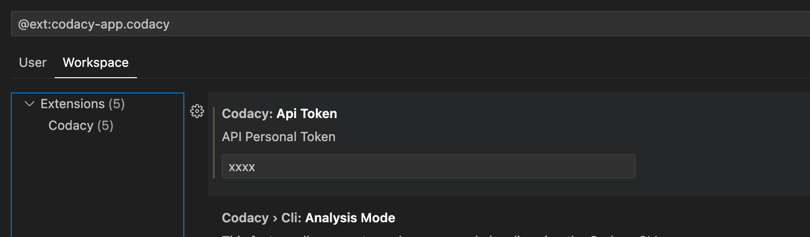

# Getting Started

Codacy Guardrails is a brand new way of enforcing code security and quality standards for AI-generated code, built into the free Codacy IDE Extension for VSCode, Copilot, Cursor, and Windsurf. Guardrails help developers ship safer, cleaner AI code by applying best practices and blocking insecure patterns while the code is being generated.

Besides real-time AI code scanning, Guardrails users can now prompt all their Codacy findings, without ever leaving the AI chat panel inside their IDE.
New to Codacy Guardrails? [Watch the Guardrails live demo](https://youtu.be/uVyRWnnJu-0?feature=shared), or [download the free Codacy Extension](https://www.codacy.com/ide-extension) and try it out yourself!

[Check our blog post](https://blog.codacy.com/codacy-guardrails-free-real-time-enforcement-of-security-and-quality-standards)

## Prerequisites

### Supported Operating Systems

- MACOs
- Linux
- Windows (Working on it)

```bash
  For Windows users:
  Windows WSL (a feature that allows you to run a Linux environment directly on Windows, without the need for a virtual machine or dual-boot setup) is the only way you can use this feature for now, but we're still working to fully support Windows. 
```

### Supported IDEs

- Visual Studio Code
- Cursor
- Windsurf

### Supported tools

- ESLint
- Trivy
- Pylint
- PMD
- DartAnalyzer
- Semgrep

## How to install the Codacy Extension
[Check our IDE extension page](https://www.codacy.com/ide-extension)

### 1.  Download the extension

- [Visual Studio Code](https://tinyurl.com/codacy-vscode)
- [Cursor](http://tinyurl.com/codacy-cursor)
- [Windsurf](http://tinyurl.com/codacy-windsurf)


### 2.  Click on Settings


### 3.  Add your API token to Workspace

Settings > Workspace > API Personal Token



### 4. Activate the Codacy CLI for local analysis

Click on the button **Install Codacy CLI**


It will create a folder in your local repository called **.codacy** with the app already installed

### 5. Install MCP Server (check the next topic in this page)

### 6. Restart your IDE

## How to install MCP Server

### Overview and Setup

- [Check all supported features](https://github.com/codacy/codacy-mcp-server/blob/master/README.md#features--tools)
- [Setup](https://github.com/codacy/codacy-mcp-server/blob/master/README.md#setup)

### NPM package

If you want to use MCP Server with a NPM package you should download it from [here](https://www.npmjs.com/package/@codacy/codacy-mcp)

Using this approach, you might have some limitations, so please have a [look at this page](codacy-guardrails-limitations.md) to make sure you understand all implications.

### Install CLI

To use the Codacy-CLI, it needs to be downloaded [here](https://github.com/codacy/codacy-cli-v2).