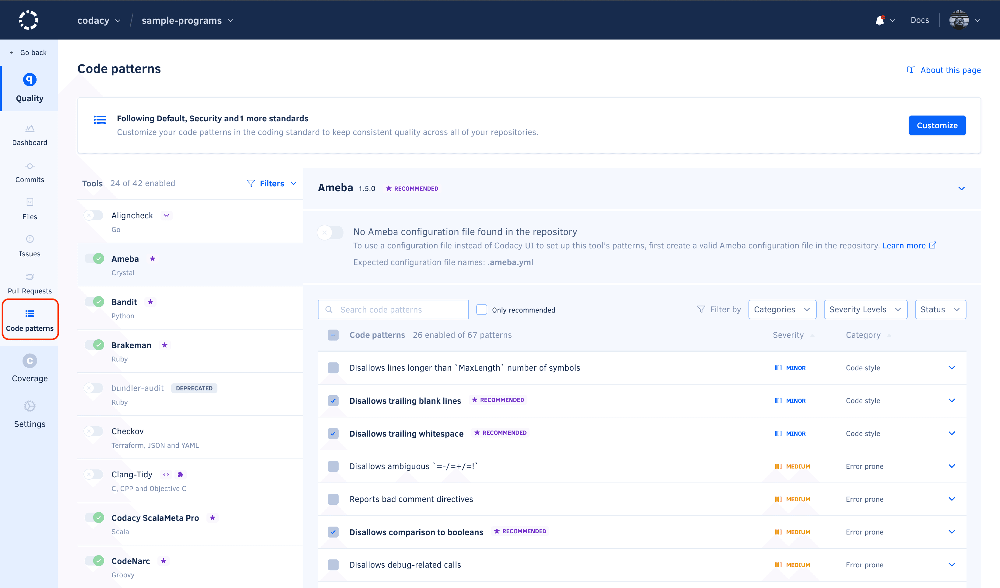
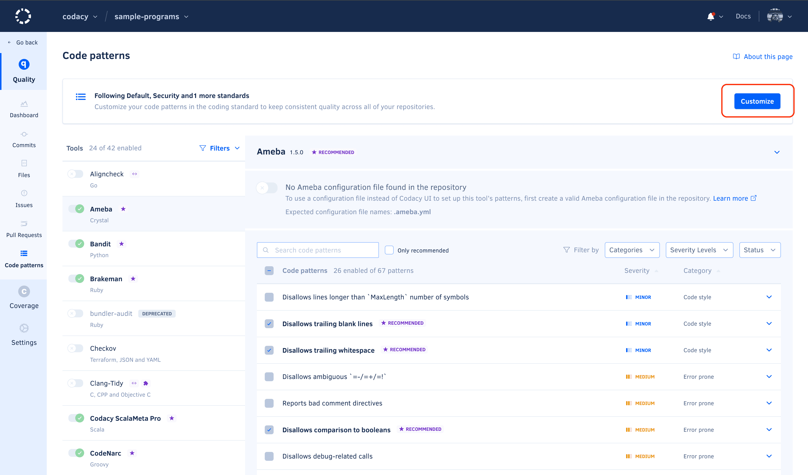

# How to configure rules in Guardrails

## Using configuration files

!!! note
    -   After activating a configuration file for a tool, Codacy uses that configuration file even if you [exclude it from Codacy analysis](ignoring-files.md).

    -   When [using a tool configuration file alongside a coding standard](../organizations/using-coding-standards.md#using-with-tool-configuration), the configuration file controls the code patterns, while the coding standard controls whether the tool is enabled or disabled.

Codacy supports configuration files for several static analysis tools to help you streamline your setup.

To use a configuration file for a static analysis tool:

1.  Push the configuration file to the root of the [default Codacy branch](../repositories-configure/managing-branches.md).

2.  Open the repository **Code patterns** page, select the tool of interest, and activate the toggle to use a configuration file.

    !!! note
        -   Codacy uses the version of the configuration file **in the branch being analyzed**. For example, if you open a pull request that includes changes to the configuration file, the analysis results take those changes into account.

        -   If Codacy analyzes a branch that doesn't include the configuration file, Codacy reverts to using the code patterns configured for the tool before you selected the option **Configuration file** on the Code patterns page.

        -   For performance reasons, when you update pattern settings using a configuration file, Codacy may display outdated messages for issues identified previously by those patterns.

    

The table below lists the configuration file names that Codacy detects and supports for each tool:

<table>
  <thead>
    <tr>
      <th>Tool name</th>
      <th>Languages</th>
      <th>Files detected</th>
      <th>Other info</th>
    <tr>
  </thead>
  <tbody>
  <tr>
    <td>dartanalyzer</td>
    <td>Dart</td>
    <td><code>analysis_options.yaml</code></td>
    <td><a href="https://dart.dev/guides/language/analysis-options">Customizing static analysis</a></td>
  </tr>
  <tr>
    <td>ESLint v8</td>
    <td>JavaScript, TypeScript</td>
    <td><code>.eslintrc.js</code>, <code>.eslintrc.cjs</code>, <code>.eslintrc.yaml</code>, <code>.eslintrc.yml</code>, <code>.eslintrc.json</code></td>
    <td></td>
  </tr>
  <tr>
    <td>PMD</td>
    <td>Apex, Java, JavaScript, JSP, PL/SQL, XML, Velocity and Visualforce</td>
    <td><code>ruleset.xml</code>, <code>apex-ruleset.xml</code></td>
    <td>Supports configuration file in directories other than root and can search up to 5 directories into the repository.</td>
  </tr>
  <tr>
    <td>Pylint</td>
    <td>Python</td>
    <td><code>pylintrc</code>, <code>.pylintrc</code></td>
    <td><a href="https://github.com/codacy/codacy-pylint-python3/blob/master/requirements.txt">Plugins</a></td>
  </tr>
  <tr>
    <td>Semgrep</td>
    <td>Apex, C++, C#, Dockerfile, Elixir, GitHub Actions, Go, Java, JavaScript, Kotlin, PHP, Python, Ruby, Rust, Scala, Shell, Swift, Terraform, TypeScript</td>
    <td><code>.semgrep.yaml</code></td>
    <td></td>
  </tr>
  </tbody>
</table>

## Using Codacy UI

To configure the tools and code patterns for a repository using the Codacy UI:

1.  Open your repository **Code patterns** page.

    

2.  Enable or disable the tools that Codacy will use to analyze the repository.

    

3.  Select a tool to enable or disable its code patterns. To make it easier to find relevant patterns, use the filters above the pattern list. You can filter by [issue category](../faq/code-analysis/which-metrics-does-codacy-calculate.md#issues), status, severity level, or display only recommended code patterns.

    To see an explanation of the issues that a pattern detects and how to fix them, click the respective dropdown arrow.

    !!! tip
        -   To enable a group of code patterns, use the filter to select the relevant group of patterns and click the checkbox in the header of the patterns list.

        -   Codacy displays the tag **New** for one month next to the name of newly added code patterns.

    

4.  Optionally, to take the changes into account immediately, [reanalyze the repository manually](../faq/repositories/how-do-i-reanalyze-my-repository.md). Otherwise, Codacy will use the updated configuration when analyzing new commits and pull requests.

### Discover code patterns across all tools

To discover code patterns across all tools, click **Discover patterns** at the top of the **Tools** list.

Use the input field to search for patterns by name or description. You can also filter by severity level, issue category, recommended or disabled patterns.

You can also expand your search to include patterns from all tools, even if the tool is not enabled for the repository.

## Using Coding Standards

To apply or edit a repository's [coding standards](../organizations/using-coding-standards.md), click **Customize** in the **Following ...** section at the top of the **Code patterns** page.

Select the coding standards that you want to follow or stop following and click **Apply**.

### Customizing patterns when following coding standards

Tools and patterns enabled by a coding standard are enforced and cannot be disabled.
You can add extra tools and patterns, if these are not enabled by any applied coding standard.