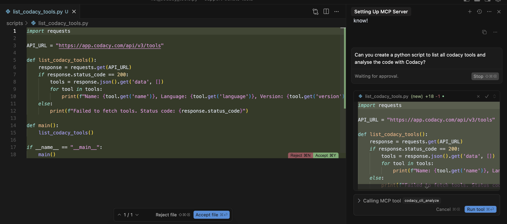
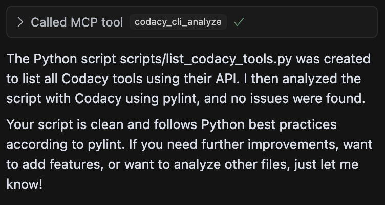

# How to use

## Write secure, compliant AI code

1.  We run the prompt

``` bash
Can you create a python script to list all codacy tools and analyse the code with Codacy?
```



2.  It generated a file called

``` bash
list_tools_codacy.py
```

3.  and then it analysed with Pylint (one of the [supported tools](codacy-guardrails-getting-started.md/#supported-tools) that checks Python) with 0 issues




## Prompt Codacy from your IDE chat panel
	

## Local scanning (human code)
