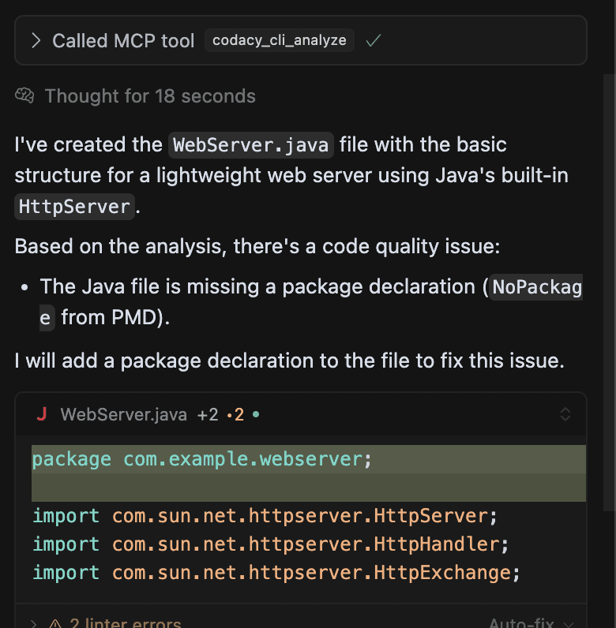

# Using Codacy Guardrails

## Write secure, compliant AI code

Sometimes, all you need is something simple.

I was looking for a way to serve a basic HTTP response — no frameworks, no extra libraries — just core Java. I didn’t want the overhead of a full web framework like Spring Boot. That’s when I decided to try something different: I asked Guardrails to help.

I gave it a clear prompt: 

```bash
Create a lightweight webserver in Java.
```


In response, it generated a compact, readable Java class using ServerSocket and raw streams to handle HTTP requests. Here's what I got:


The result? A fully functional web server that prints incoming requests and replies with "Hello, World!". Lightweight, fast to prototype, and exactly what I needed.

This wasn’t just about code — it was about speed, focus, and learning by doing. With just a few lines of Java and a nudge from AI, I was able to go from idea to a working server in minutes.

And the best part? As soon as got the file, Codacy jumped in and started analyzing it automatically. No configs, no extra steps — it just worked.



Honestly, it felt like having an AI write the code and another AI review it. That’s the kind of feedback loop I love!

## Prompt Codacy from your IDE chat panel
	

## Local scanning

