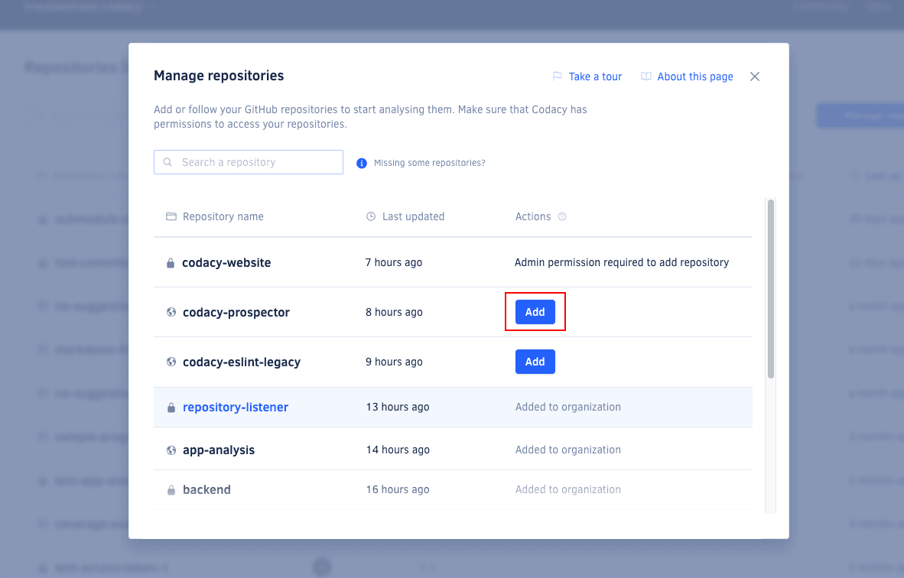

# Codacy Coverage quickstart

Codacy Coverage is [TBD]
<!--TODO Review
    an automated code quality and coverage platform that analyzes your source code and identifies issues as you go, helping your team ship robust software by scanning over 40 programming languages, such as JavaScript, Python, Java, C#, and PHP.
-->

By integrating with your Git provider, Codacy [TBD]
<!--TODO Review
    keeps track of your team’s work, analyzes relevant commits, highlights problems, suggests improvements, and protects your codebase from unwelcome changes. From organization and repository level to individual files, pull requests, and commits, Codacy monitors the following metrics across your projects:

    -   **Coverage**: the percentage of lines of code covered by automated tests
-->

## Adding your first repository

<!--TODO {--% include-markdown "../assets/includes/nav-multistep-quickstart.md" %--}-->

To get started, head to [codacy.com](https://www.codacy.com/) and click **Get started**<!--TODO Review link-->. Then, follow these steps:

1.  [Signing up](#signing-up)
1.  [Choosing an organization](#choosing-organization)
1.  [Adding repositories](#adding-repositories)
1.  [Adding coverage reports](#adding-coverage)

## 1. Signing up {: id="signing-up"}

Sign up with a Git provider such as GitHub, GitLab, or Bitbucket. This links your Codacy user with your Git provider user, making it easier to add repositories to Codacy and invite your teammates.

Codacy will request access to your Git provider during the authorization flow. [Check the permissions that Codacy requires and why](../../getting-started/which-permissions-does-codacy-need-from-my-account.md).

## 2. Choosing an organization {: id="choosing-organization"}

Now, you'll need to add or join the organizations that contain your repositories. The organization with the same name as your Git provider username contains your personal repositories. Read more about [organizations on Codacy](../../organizations/what-are-organizations.md).

To start adding your repositories, select one of the organizations.

!!! note
    If you can't see the organization you're looking for, [follow these troubleshooting instructions](../../faq/troubleshooting/why-cant-i-see-my-organization.md).

  

## 3. Adding repositories {: id="adding-repositories"}

Next, add the repositories that you wish to use on Codacy.

!!! note
    You can only add repositories on Codacy if you have the [necessary permissions on your Git provider](../../organizations/roles-and-permissions-for-organizations.md).

Click the link **Go to repository** to start configuring your new repository on Codacy.

## 4. Adding coverage to your repository {: id="adding-coverage"}
<!--TODO Review
    Once you've added your first repository, it's important that you configure Codacy's analysis tools to match the use cases of your team, such as configuring any coding conventions and best practices that your team may already be following or that you want to promote. It's also critical to review the configurations to avoid reporting false positives or any other issues that don't bring value to your team, which can introduce unwanted delays to the development process.

    You can optionally add coverage reports to detail how much of your code is covered by tests and unify your quality and coverage pipelines. You can generate coverage reports and upload them to Codacy using a range of options, such as CI/CD integration, CLI, Docker, GitHub action, and more.
-->

If you want to use code coverage to block merging pull requests that don't meet your quality standards, make sure that you [add coverage to your repository](../../coverage-reporter/index.md).

It's important that you set up coverage beforehand because Codacy can only report the coverage status for pull requests after receiving reports for the last commits **on both the pull request branch and the target branch**.

## Next steps {: id="next-steps"}

Once you're satisfied with your setup, [integrate Codacy with your Git workflow](integrating-codacy-with-your-git-workflow.md) to report the coverage metrics directly on your pull requests and block problematic pull requests.

!!! tip
    To showcase the current code coverage percentage, [add a Codacy badge to your repository](../../getting-started/adding-a-codacy-badge.md).
