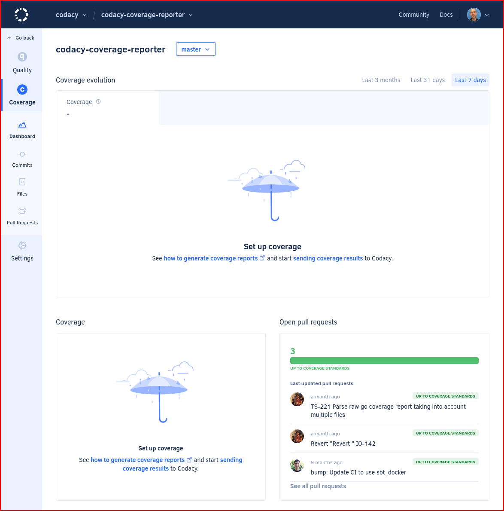
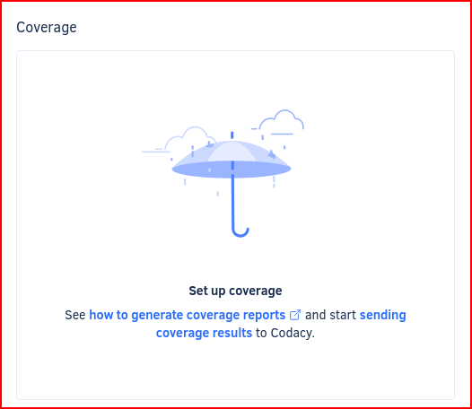
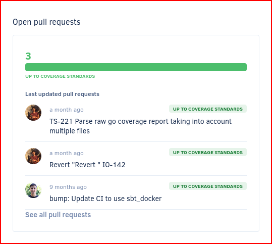

# [Coverage] Repository Dashboard
<!--TODO
    Review page, see https://codacy.atlassian.net/browse/COV-115 for more details-->

The **Repository Dashboard** provides an overview of the repository coverage and items that require your attention.

To access your Repository Dashboard, select a repository from the [Repositories list](../../organizations/managing-repositories.md) and select **Dashboard** on the left navigation sidebar.

!!! tip
    You can share the URL of the Repository Dashboard for your **public repositories** to allow other people to see your repository coverage metrics, even if they aren't registered on Codacy.

<!--TODO Update-->

The top of the Repository Dashboard displays:

-   The name of the repository
-   A drop-down list that selects which branch of your repository to display on the dashboard

On the Repository Dashboard you have the following areas to help you monitor your repository:

-   [Coverage evolution chart](#coverage-evolution-chart)
-   [Coverage](#coverage)
-   [Open pull requests](#open-pull-requests)

The following sections provide a detailed overview of each dashboard area.

<!--TODO Include this information?

-->

## Coverage evolution chart

The **Coverage evolution** chart displays the evolution of the repository [code coverage](../../faq/code-analysis/which-metrics-does-codacy-calculate.md#code-coverage). Click on **Last 3 months**, **Last 31 days**, or **Last 7 days** to select the time interval of the historical data to display on the chart.

The tab displays the following information:

-   A green or red indicator depending if coverage is within the acceptable level or not
-   The current coverage value
-   The coverage variation introduced by the last commit

!!! note
    The chart only displays a value if Codacy received coverage data for the most recent commit. This is because one commit can easily change the size or number of files on the repository, or even remove some files that had coverage information.

The chart also displays the **trendline** based on the past behavior and the **coverage goal** defined on the repository [quality settings](../../repositories-configure/adjusting-quality-settings.md).

<!--TODO Update-->

## Coverage

The **Coverage** area displays the percentage of lines of code on the selected branch that are covered by tests versus the [coverage goal](../../repositories-configure/adjusting-quality-settings.md#goals) defined in the quality settings of the repository, as well as the number of files:

-   Without coverage
-   With coverage not up to standards (based on the coverage goal)
-   With coverage up to standards (based on the coverage goal)

Click **See all files** to open the [list of files](files.md) in the repository.

!!! tip
    If you don't have coverage set up for your repository yet, the Coverage area provides you with instructions on [how to add coverage for your repository](../../coverage-reporter/index.md).

<!--TODO Update-->

## Open pull requests

The **Open pull requests** area displays the last updated pull requests and the split between the status of all open pull requests in your repository:

-   **Up to coverage standards:** Pull requests that meet the minimum coverage levels
-   **Not up to coverage standards:** Pull requests that failed to meet at least one of the [coverage gate rules defined for the repository](../../repositories-configure/adjusting-quality-settings.md#gates)
-   **No information:** Pull requests that didn't receive the coverage reports required for Codacy to calculate the coverage metrics

Click a bar segment to display only pull requests with the corresponding status.

To see the details of pull requests, click a pull request from the list or click **See all pull requests** to open the [list of pull requests](pull-requests.md) in the repository.

<!--TODO Update-->

## See also

-   [Which metrics does Codacy calculate?](../../faq/code-analysis/which-metrics-does-codacy-calculate.md)
-   [Using the Codacy API to obtain code quality metrics for files](../../codacy-api/examples/obtaining-code-quality-metrics-for-files.md)
