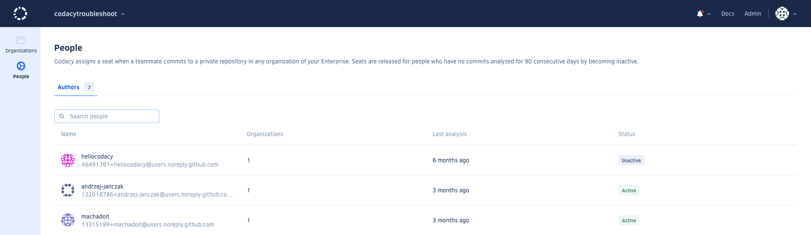

# GitHub Enterprise Cloud

When you use GitHub Enterprise to sign up or log into Codacy, the GitHub Enterprise organizations, that you belong to, will be available to be added as Organizations on Codacy.

After connecting with your Enterprise account Codacy displays the list of all organizations that you have access to in that Enterprise, and you can add to start analysing its repositories or join it. 

### GitHub Enterprise types
Codacy supports both [GitHub Enterprises types](https://docs.github.com/en/enterprise-cloud@latest/admin/managing-iam/understanding-iam-for-enterprises/choosing-an-enterprise-type-for-github-enterprise-cloud), Managed Users and Personal Accounts.

## Access cloud Enterprises 
Access you enterprises in codacy by setting up its integration. In codacy app, click on your avatar image, in the top right corner, then navigate throught "My account" and "Access management". There, you'll be able to add a **GitHub Enterprise Cloud** access token. Once generated and added in Codacy you will start seeing all infomration you have access to regarding your cloud enterprises. 
You can revoke the cloud enterpises access at any time in the same place.

## Manage Enterprises 
- [Enterprise organizations list](#enterprise-organizations-list)
- [Seats management](#seats)
- [Enterprise Limitations](#limitations)

Once signed up or login with your GitHub enterprise account and, settingup access to could enterprises (LINK TO ABOVE), navigate to your Enterprises area. There you can manage the git Enterprises that are in Codacy, as well its organizations and seats management. 

!!! note If you only have one Enterprise, Codacy will skip this screen and directs you to the Enterprise organizations list. 

### Enterprise organizations list
View a enterprise organization and access its list of organizations. 

### Seats
View and export your enterprise seats and its activity.

### Limitations
Currently, the integration between Codacy and GitHub Enterprise has the following limitations:

-   **Repositories with visibility Internal** will, in Codacy, have the same behavior as Private visibility. Although you see the repository in the provider, if you aren't part of the repository in the provider, you won't be able to see it in Codacy.
-   **Same email connected to multiple GitHub accounts.** Codacy won't allow you to connect your enterprise account if that email is already associated with a different GitHub account. You can manage your [associated emails in the provider GitHub](https://docs.github.com/en/account-and-profile/setting-up-and-managing-your-personal-account-on-github/managing-email-preferences/adding-an-email-address-to-your-github-account). 

## See also

-   [How does Codacy support GitLab Cloud?](../faq/general/how-does-codacy-support-gitlab-cloud.md)
-   [How does Codacy support GitLab Enterprise?](../faq/general/how-does-codacy-support-gitlab-enterprise.md)
-   [How does Codacy support Bitbucket Cloud?](../faq/general/how-does-codacy-support-bitbucket-cloud.md)
-   [How does Codacy support Bitbucket Server?](../faq/general/how-does-codacy-support-bitbucket-server.md)