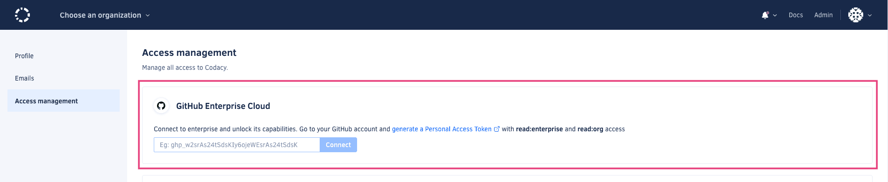

# GitHub Enterprise Cloud

Use your GitHub Enterprise credentials when signup or login to Codacy and all your GitHub Enterprise organizations that you belong to, will be available to be added as Organizations on Codacy.

Codacy also has a dedicated Enterprise area where GitHub Enterprise admins and owners of the enterprise will be able to manage them.

### GitHub Enterprise types
Codacy supports both [GitHub Enterprises types](https://docs.github.com/en/enterprise-cloud@latest/admin/managing-iam/understanding-iam-for-enterprises/choosing-an-enterprise-type-for-github-enterprise-cloud), Managed Users and Personal Accounts.

## Access cloud Enterprises 
Access you enterprises in Codacy by setting up its integration:

1. In codacy app, click on your avatar image, in the top right corner
1. then navigate throught "My account" and "Access management"
1. There, you'll be able to add a **GitHub Enterprise Cloud** access token. 

Once generated and added in Codacy you will start seeing all infomration you have access to regarding your cloud enterprises. 
You can revoke the cloud enterpises access at any time in the same place.

## Manage Enterprises 
- [Enterprise organizations list](#enterprise-organizations-list)
- [Seats management](#seats)
- [Enterprise Limitations](#limitations)

Once signup or login with your GitHub Enterprise credentials and, [setup access to could enterprises](#access-cloud-enterprises), navigate to your Enterprises area to manage your enterprises in Codacy, as well its organizations and seats management. 

!!! note 
    If you only have one Enterprise, Codacy will skip this screen and directs you to the [enterprise organizations list](#enterprise-organizations-list). 

### Enterprise organizations list
Choose to view a enterprise and access its list of existing organizations, that you have access to.

### Seats
View and export your enterprise seats and its activity by:

1. Choose and view an enterprise organization
1. Navigate to **People** on the left-handside navigation
1. View, search and export the list of author seats

!!! note 
    - Codacy members will not be part of this list, only authors, users that have dome commits. 
    - Only Enterprise **Owners** or **Admins** will be able to view and export the list of authors. 

### Limitations
Currently, the integration between Codacy and GitHub Enterprise has the following limitations:

-   **Repositories with visibility Internal** will, in Codacy, have the same behavior as Private visibility. Although you see the repository in the provider, if you aren't part of the repository in the provider, you won't be able to see it in Codacy.
-   **Same email connected to multiple GitHub accounts.** Codacy won't allow you to connect your enterprise account if that email is already associated with a different GitHub account. You can manage your [associated emails in the provider GitHub](https://docs.github.com/en/account-and-profile/setting-up-and-managing-your-personal-account-on-github/managing-email-preferences/adding-an-email-address-to-your-github-account). 

## See also

-   [How does Codacy support GitLab Cloud?](../faq/general/how-does-codacy-support-gitlab-cloud.md)
-   [How does Codacy support GitLab Enterprise?](../faq/general/how-does-codacy-support-gitlab-enterprise.md)
-   [How does Codacy support Bitbucket Cloud?](../faq/general/how-does-codacy-support-bitbucket-cloud.md)
-   [How does Codacy support Bitbucket Server?](../faq/general/how-does-codacy-support-bitbucket-server.md)

  
***
#### Check out what's new, and to come, in Codacy

  <iframe id="inlineRoadmap"
      title="Codacy Roadmap"
      width="100%"
      height="472"
    src="https://portal.productboard.com/2ng56ct2oir3adgbkvzfgqks" frameborder="0" >
  </iframe>

