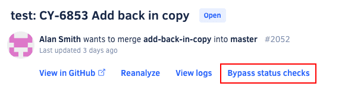

# Can I bypass Codacy status check?

!!! note
    **This will only apply to gates enforcing quality checks.** If coverage is blocking a pull request analysis, we recommend contacting your git provider admin or temporarily disabling the coverage gate on the repo and reanalyzing the pull request before enabling them again.

To protect your code from unwelcome changes, you can [configure your Git workflow to block merging pull requests](../../getting-started/integrating-codacy-with-your-git-workflow.md#blocking-pull-requests) if they don't pass the Codacy status check.

However, on **very specific and exceptional situations** where your pull request merging is blocked due to an unexpected issue not related to the quality of your code, Codacy allows **repository admins** to bypass the Codacy status check for that pull request.

To bypass Codacy status check for a pull request, a repository admin must click **Bypass status checks** on the [pull request status area](../../repositories/pull-requests.md#status) of the pull request detail screen.

