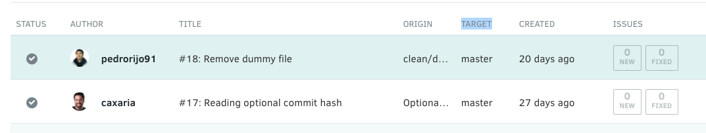

# Does Codacy automatically analyze all pull requests?

We analyze pull requests automatically as long as the target branch is enabled.

To learn more about how to enable branches, have a look [here](/hc/en-us/articles/207280019-Managing-Branches).

