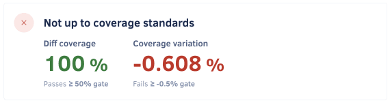
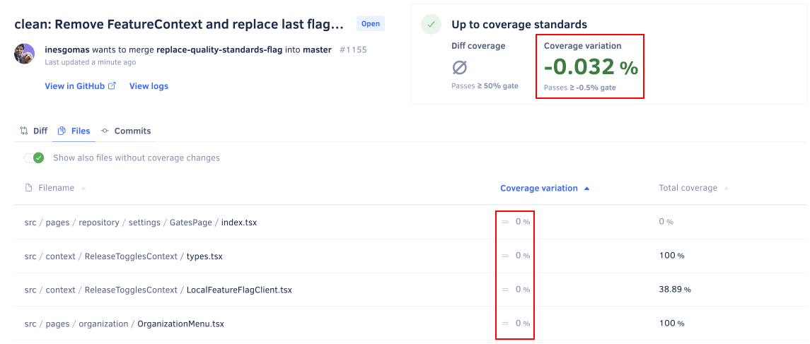

# Why does Codacy show unexpected coverage changes?

You may encounter some situations where Codacy shows unexpected drops in coverage, potentially causing your quality gates to fail. Usually, these drops in coverage happen in files that the commit or pull request didn't change.

There are multiple reasons for this, but it's important to understand that each coverage report that you upload to Codacy contains information about which lines of code in your repository are tested or not in a specific commit. In particular, each coverage report provides the following information about the lines of your source code files:

-   **Coverable lines** (lines that can be tested), by listing those lines
-   **Covered lines** (lines that were tested at least once), by marking those lines as tested or having a number of test hits
-   **Not coverable lines** (lines that can't be tested), by not listing those lines

For example, the coverage report represented below includes coverage information for two source code files:

-   File `ClassA.java` has two coverable lines and all are covered by tests
-   File `ClassB.java` has three coverable lines but only line 1 is covered by tests

<table>
  <thead>
    <tr>
      <th>File</th>
      <th>Line number</th>
      <th>Covered by tests?</th>
    </tr>
  </thead>
  <tbody>
    <tr>
      <td rowspan="2">ClassA.java</td>
      <td>2</td>
      <td>Yes</td>
    </tr>
    <tr>
      <td>4</td>
      <td>Yes</td>
    </tr>
    <tr>
      <td rowspan="3">ClassB.java</td>
      <td>1</td>
      <td>Yes</td>
    </tr>
    <tr>
      <td>3</td>
      <td>No</td>
    </tr>
    <tr>
      <td>11</td>
      <td>No</td>
    </tr>
  </tbody>
</table>

Based on the information obtained from the coverage reports, Codacy calculates code coverage as follows:

-   The **coverage** for a file, commit, or pull request is the percentage of covered lines in the universe of coverable lines for that file, commit, or pull request. For example, a commit with 85 covered lines out of a total of 100 coverable lines has 85% coverage.



!!! important
    Note that changes external to a source code file can affect the lines that are or aren't covered in that file.

## Common reasons for unexpected coverage changes

There are several reasons that could cause Codacy to report unexpected coverage results, from changes to your source code to external factors. The following is a non-exhaustive list of the most common reasons:

-   Adding new tests or removing existing tests from your project.

    Even small and localized changes to your tests can have an impact on the amount of covered lines across your repository.

-   Changing the logic of your application or tests.

    Changing the control flow of your application or tests can mean that different areas of your code start or stop being covered by tests. For example, inverting the result of the Boolean expression of an if statement means that a different branch of your code could now be tested.

-   Failing to upload coverage reports, or uploading a different number of reports between commits.

    This can be caused by a failed step in your CI/CD pipeline, for example. In the case of pull requests, you should make sure that you upload all relevant coverage reports for both the merge base commit and the HEAD commit of the pull request branch.

-   External factors affecting the execution of tests.

    A variety of factors that are external to your code can affect the execution of tests and, consequently, the results contained in the coverage reports. A few examples of these external factors are:

    -   Updates to dependencies of your project that could result in different test execution paths
    -   Misconfiguration of repository secrets that could prevent some test execution paths
    -   Tests that are dependent on time, such as running test cases only on specific dates or times of the day
    -   "Flaky" tests caused by any inconsistent or unreliable behavior of your code, infrastructure, or third-party services

The following examples describe in more detail how specific changes in your code are reflected on the metrics that Codacy calculates.

## Example: Diff coverage is 100% but pull request coverage variation is negative

Consider an example pull request where Codacy shows the following metrics:

-   100% diff coverage
-   A negative coverage variation

There are two possible scenarios that could cause this result:

-   **Removing covered lines or tests**

    Since diff coverage only applies to covered lines that the pull request added or modified, removed lines don't affect the diff coverage metric. However, removing covered lines or tests means that there are now less covered lines in the repository, causing a drop in coverage.

-   **Application logic changes**

    A change in the flow of execution of your application or tests can mean that a different number of coverable lines in your repository are now covered by tests, causing a drop in coverage. However, if all lines modified in the pull request continue to be covered, the diff coverage metric is 100%.

The table below represents two example coverage reports reflecting a pull request that causes line 1 of the file `ClassB.java` to stop being covered:

<table>
  <thead>
    <tr>
      <th></th>
      <th colspan="2" style="text-align: center;">Merge base commit</th>
      <th colspan="2" style="text-align: center;">HEAD commit</th>
    </tr>
    <tr>
      <th>File</th>
      <th>Line number</th>
      <th>Covered by tests?</th>
      <th>Line number</th>
      <th>Covered by tests?</th>
    </tr>
  </thead>
  <tbody>
    <tr>
      <td rowspan="2">ClassA.java</td>
      <td>2</td>
      <td>Yes</td>
      <td>2</td>
      <td>Yes</td>
    </tr>
    <tr>
      <td>4</td>
      <td>Yes</td>
      <td>4</td>
      <td>Yes</td>
    </tr>
    <tr>
      <td rowspan="3">ClassB.java</td>
      <td>1</td>
      <td>Yes</td>
      <td>1</td>
      <td style="background-color:  salmon;">No</td>
    </tr>
    <tr>
      <td>3</td>
      <td>No</td>
      <td>3</td>
      <td>No</td>
    </tr>
    <tr>
      <td>11</td>
      <td>No</td>
      <td>11</td>
      <td>No</td>
    </tr>
  </tbody>
</table>

The table below displays the code coverage metrics as calculated by Codacy:

-   Initially, `ClassB.java` was 33.33% covered but after the changes from the pull request the file is now 0% covered, causing the repository coverage to drop 20%
-   As long as the pull request also modified any covered line that continues to be covered, the diff coverage is 100%

<table>
  <thead>
    <tr>
      <th></th>
      <th colspan="3" style="text-align: center;">Merge base commit</th>
      <th colspan="3" style="text-align: center;">HEAD commit</th>
      <th colspan="2" style="text-align: center;">Pull request results</th>
    </tr>
    <tr>
      <th>File</th>
      <th>Coverable lines</th>
      <th>Covered lines</th>
      <th>Coverage</th>
      <th>Coverable lines</th>
      <th>Covered lines</th>
      <th>Coverage</th>
      <th>Coverage variation</th>
      <th>Diff coverage</td>
    </tr>
  </thead>
  <tbody>
    <tr>
      <td>ClassA.java</td>
      <td>2</td>
      <td>2</td>
      <td title="2/2 x 100% = 100%">100%</td>
      <td>2</td>
      <td>2</td>
      <td title="2/2 x 100% = 100%">100%</td>
      <td title="100% - 100% = 0%">0%</td>
      <td></td>
    </tr>
    <tr>
      <td>ClassB.java</td>
      <td>3</td>
      <td>1</td>
      <td title="1/3 x 100% = 33.33%">33.33%</td>
      <td>3</td>
      <td>0</td>
      <td title="0/3 x 100% = 0%">0%</td>
      <td title="0% - 33.33% = -33.33%">-33.33%</td>
      <td></td>
    </tr>
    <tr>
      <td><strong>Total</strong></td>
      <td>5</td>
      <td>3</td>
      <td title="3/5 x 100% = 60%">60%</td>
      <td>5</td>
      <td>2</td>
      <td title="2/5 x 100% = 40%">40%</td>
      <td title="40% - 60% = -20%" style="color: red;">-20%</td>
      <td style="color: green;">100%</td>
    </tr>
  </tbody>
</table>

## Example: Pull request coverage variation is negative but no files have coverage variation

Consider an example pull request where Codacy shows the following metrics:

-   Negative coverage variation
-   There aren't any files with coverage variation

**Removing covered lines** from a file that had 100% coverage means that the file will continue to have 100% coverage. All lines in the file continue to be covered, even though there are now less covered lines. As such, there is no coverage variation for the file.

However, since the proportion between the total number of covered and coverable lines across all files in the repository is now different, there can be a drop in the coverage variation for the pull request.

The table below represents two example coverage reports reflecting a pull request that removes lines 5 and 6 of the file `ClassA.java`:

<table>
  <thead>
    <tr>
      <th></th>
      <th colspan="2" style="text-align: center;">Merge base commit</th>
      <th colspan="2" style="text-align: center;">HEAD commit</th>
    </tr>
    <tr>
      <th>File</th>
      <th>Line number</th>
      <th>Covered by tests?</th>
      <th>Line number</th>
      <th>Covered by tests?</th>
    </tr>
  </thead>
  <tbody>
    <tr>
      <td rowspan="5">ClassA.java</td>
      <td>2</td>
      <td>Yes</td>
      <td>2</td>
      <td>Yes</td>
    </tr>
    <tr>
      <td>4</td>
      <td>Yes</td>
      <td>4</td>
      <td>Yes</td>
    </tr>
      <td>5</td>
      <td>Yes</td>
      <td style="background-color:  salmon;"></td>
      <td style="background-color:  salmon;"></td>
    <tr>
    </tr>
      <td>6</td>
      <td>Yes</td>
      <td style="background-color:  salmon;"></td>
      <td style="background-color:  salmon;"></td>
    <tr>
    </tr>
    <tr>
      <td rowspan="3">ClassB.java</td>
      <td>1</td>
      <td>Yes</td>
      <td>1</td>
      <td>Yes</td>
    </tr>
    <tr>
      <td>3</td>
      <td>No</td>
      <td>3</td>
      <td>No</td>
    </tr>
    <tr>
      <td>11</td>
      <td>No</td>
      <td>11</td>
      <td>No</td>
    </tr>
  </tbody>
</table>

The table below displays the code coverage metrics as calculated by Codacy:

-   Initially, `ClassA.java` was 100% covered and continues to be 100% covered after the pull request, causing the coverage variation for the file to be 0%
-   However, there were 62.5% lines covered across all files in the repository but after the pull request only 60% of the lines are now covered, causing the pull request coverage variation to drop 2.5%

<table>
  <thead>
    <tr>
      <th></th>
      <th colspan="3" style="text-align: center;">Merge base commit</th>
      <th colspan="3" style="text-align: center;">HEAD commit</th>
      <th style="text-align: center;">Pull request results</th>
    </tr>
    <tr>
      <th>File</th>
      <th>Coverable lines</th>
      <th>Covered lines</th>
      <th>Coverage</th>
      <th>Coverable lines</th>
      <th>Covered lines</th>
      <th>Coverage</th>
      <th>Coverage variation</th>
    </tr>
  </thead>
  <tbody>
    <tr>
      <td>ClassA.java</td>
      <td>4</td>
      <td>4</td>
      <td title="4/4 x 100% = 100%">100%</td>
      <td>2</td>
      <td>2</td>
      <td title="2/2 x 100% = 100%">100%</td>
      <td title="100% - 100% = 0%">0%</td>
    </tr>
    <tr>
      <td>ClassB.java</td>
      <td>3</td>
      <td>1</td>
      <td title="1/3 x 100% = 33.33%">33.33%</td>
      <td>3</td>
      <td>1</td>
      <td title="1/3 x 100% = 33.33%">33.33%</td>
      <td title="33.33% - 33.33% = 0%">0%</td>
    </tr>
    <tr>
      <td><strong>Total</strong></td>
      <td>7</td>
      <td>5</td>
      <td title="5/7 x 100% = 62.5%">62.5%</td>
      <td>5</td>
      <td>3</td>
      <td title="3/5 x 100% = 60%">60%</td>
      <td title="60% - 62.5% = -2.5%" style="color: red;">-2.5%</td>
    </tr>
  </tbody>
</table>

## See also

-   [Which metrics does Codacy calculate?](which-metrics-does-codacy-calculate.md#code-coverage)
