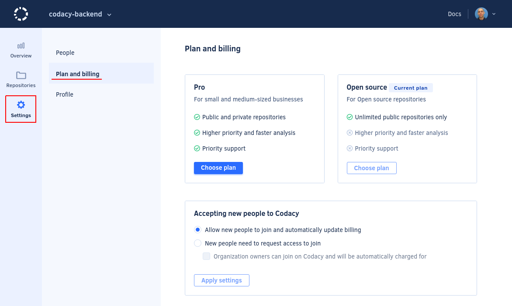

# How can I change or cancel my plan?

You can change or cancel [your Codacy plan](https://www.codacy.com/pricing) at any time. If you choose to cancel your annual subscription before the conclusion of the 12 months, your account will continue to work for the remainder of the annual billing period.

## If you're using Codacy Cloud

To make changes to the plan of your organization, open your organization **Settings**, page **Plan and billing**.

Alternatively, you can also [delete your organization](../../organizations/what-are-synced-organizations.md#deleting-an-organization) to remove all its repositories from Codacy and cancel your existing plan.

!!! note
    **For legacy single accounts,** click on your avatar, select **Your Account**, and open the page **Plan and billing**.
    {: id="single-accounts"}

    Alternatively, you can also [delete your account](../../account/managing-your-profile.md#deleting-your-account) to remove all your personal repositories from Codacy and cancel your existing plan.

!!! note
    **If you're using GitHub Marketplace,** make changes to your billing details or cancel your plan directly on your [GitHub Billing page](https://github.com/settings/billing).

## If you're using Codacy Self-hosted

We kindly ask that you send us a message and we'll swiftly process the cancellation.

We value feedback and thank you in advance for letting us know the primary reason behind your decision to leave, whether budgetary constraints or missing deal-breaker functionality.
