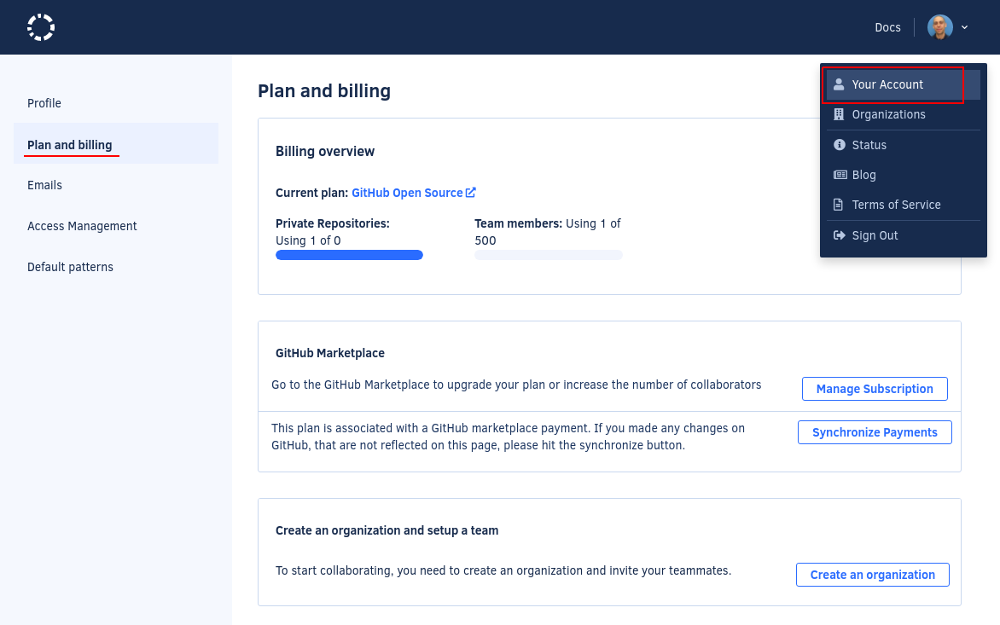
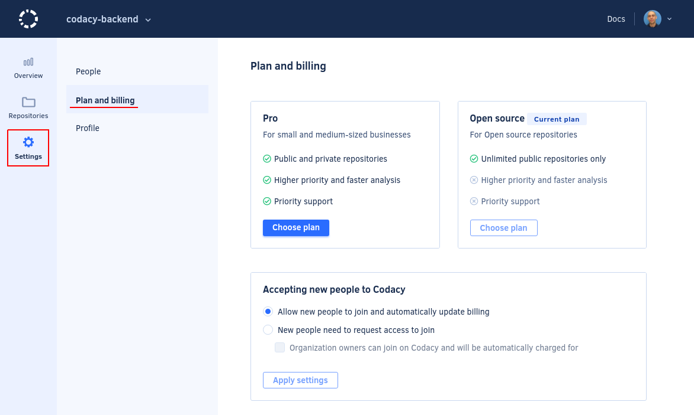

# How can I change or cancel my plan?

You can change or cancel [your plan](https://www.codacy.com/pricing) at any time. If you choose to cancel your annual subscription before the conclusion of the 12 months, your account will continue to work for the remainder of the annual billing period.

**If you're using Codacy Cloud** you can make changes to your plan yourself.

For single accounts:

-   To change the billing details or the plan of your account click on your avatar, select **Your Account**, and open the page **Plan and billing**

    

-   To cancel your plan, [delete your account](../../account/managing-your-profile.md#deleting-your-account)

For organizations:

-   To change the billing details or the plan of your organization click on your avatar, select **Organizations**, select your organization, open the page **Settings**, and open **Plan and billing**

    

-   To cancel your plan, [delete your organization](../../organizations/what-are-synced-organizations.md#deleting-an-organization)

!!! note
    If you're using GitHub Marketplace, make changes to your billing details or cancel your plan directly on your [GitHub Billing page](https://github.com/settings/billing).

**If you're using Codacy Self-hosted**, we kindly ask that you send us a message and we'll swiftly process the cancellation.

We value feedback and thank you in advance for letting us know the primary reason behind your decision to leave, whether budgetary constraints or missing deal-breaker functionality.
