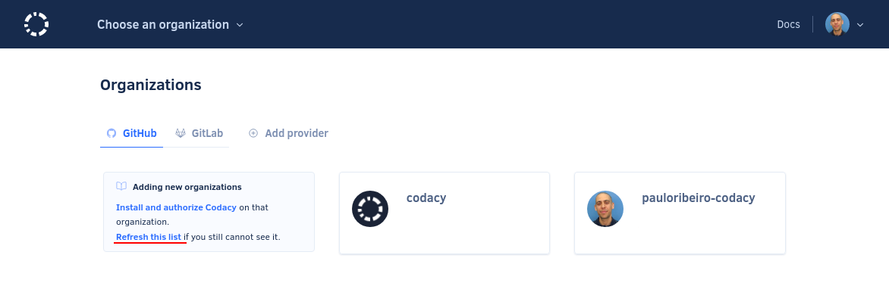

# Why can't I see my organization?

If you don't see your organization when [adding your organization on Codacy](../../organizations/what-are-synced-organizations.md#adding-an-organization), try the following steps:

1.  Make sure you have access to the organization with the account you're logged in.

1.  **If you're using GitHub:**

    1.  [Install and authorize Codacy on your organization](https://github.com/apps/codacy-production/installations/new).

    1.  Check if you've reached the [maximum number of organization event webhooks](https://docs.github.com/en/developers/webhooks-and-events/webhooks/about-webhooks){: target="_blank"} and delete any webhooks that are no longer needed.

        To do this, open your GitHub organization page, tab **Settings**, **Webhooks**. Codacy must be able to add a new organization webhook for the events Meta, Organizations, and Repositories.

1.  Refresh the list of organizations on Codacy by clicking **refresh this list** on the Organizations page:

    

1.  Revoke Codacy's OAuth application on the Git provider website and log in again to Codacy.

If these steps don't solve the issue, please contact us at <mailto:support@codacy.com>.
