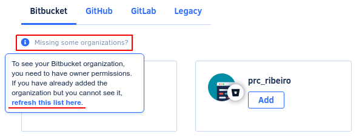

# Why can't I see my organization?

If you don't see your organization on Codacy, try the following steps:

1.  Make sure you have access to the organization with the account you are logged in.
2.  **If your are using GitHub Apps,** [install Codacy on your organization](https://github.com/apps/codacy-production/installations/new).
3.  Refresh the list of organizations on Codacy by clicking **Missing some organizations?** on the organizations list page:

    

4.  Revoke Codacy's OAuth application on the Git provider website and log in again to Codacy.

If these steps don't solve the issue, reach out to us on <support@codacy.com>.
