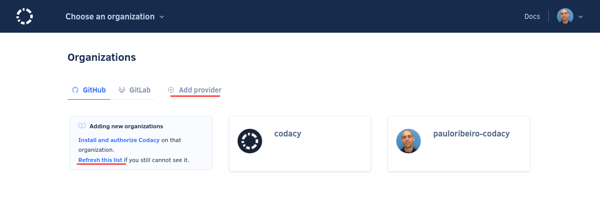
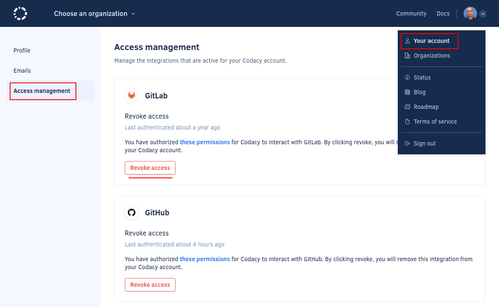

# Why can't I see my organization?

If you can't [add your organization to Codacy](../../organizations/what-are-synced-organizations.md#adding-an-organization) because it doesn't appear on the Organizations page, please try re-adding your Git provider or refreshing the list of organizations by clicking **Add provider** or **Refresh this list** on the Organizations page:

If you still can't see your organization on Codacy, follow the steps below and **refresh the list of organizations after each step** to check if the issue is solved:

1.  Re-add your Git provider or refresh the list of organizations on Codacy by clicking **Add provider** or **Refresh this list** on the Organizations page:

    

1.  Make sure that you have access to the organization on the Git provider using the account that you used to log in on Codacy.

1.  **If you're using GitHub** [install and authorize Codacy on your organization](https://github.com/apps/codacy-production/installations/new).

1.  [Revoke Codacy's OAuth integration](../../getting-started/which-permissions-does-codacy-need-from-my-account.md#revoking-access-to-integrations) with your Git provider and log in again to Codacy.

    

If these steps don't solve the issue, please contact us at <mailto:support@codacy.com>.
