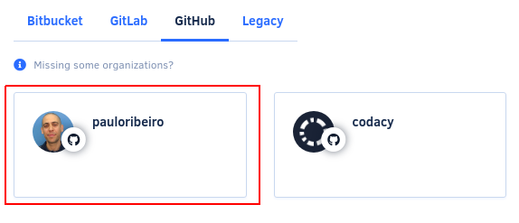
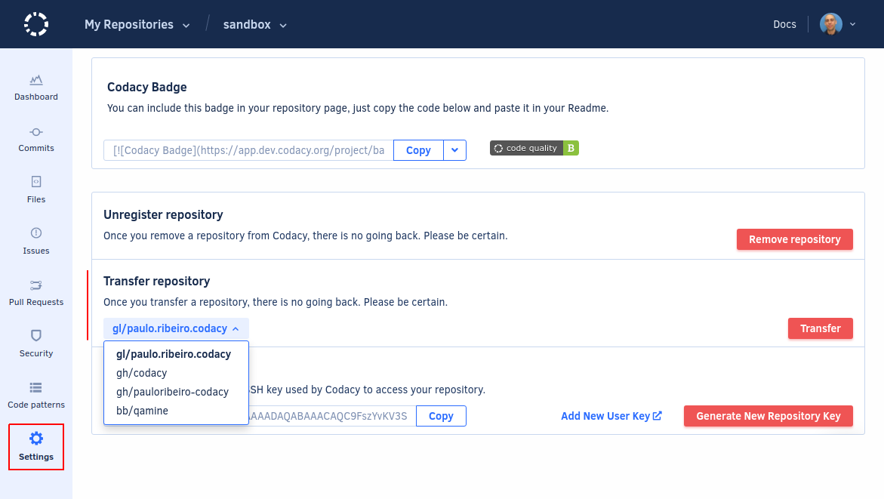

# How do I migrate a legacy repository to a synced organization?

If you have legacy personal repositories or repositories in manual organizations, you can migrate these repositories to a synced organization while keeping your Codacy configurations and analysis history.

To migrate a legacy repository you must have [admin permissions](../../organizations/manual-organizations/administrative-permissions.md) for that repository.

To migrate your legacy repository to a synced organization:

1.  Click your avatar, select **Organizations**, and ensure that the target organization already exists on Codacy.

    If the target organization is not added to Codacy yet, [add your organization to Codacy](../../organizations/what-are-synced-organizations.md#adding-an-organization) before continuing.

    !!! tip
        Personal organizations have the same name as your username on your Git provider. For example:

        

1.  Open your legacy repository **Settings**, tab **General**.

1.  In the section **Transfer repository**, select the target organization and click the button **Transfer**.

    

1.  Update the Repository Dashboard URL that you were using for the legacy repository. For example, if you had shared the Repository Dashboard with your team, provide them with the new URL.

    !!! note
        Although the old URLs for the repository dashboards continue to work, they are deprecated and we recommend that you use the new URLs instead.
