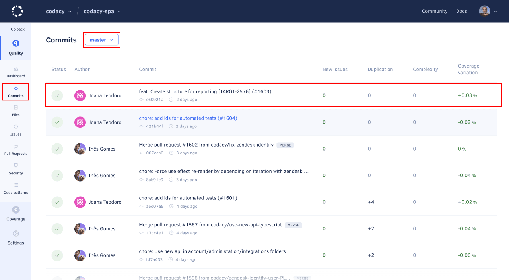

# How do I reanalyze my repository?

To reflect the most recent configurations for your repository on the Codacy analysis results without waiting for a new commit to trigger the analysis, reanalyze the last commit in your branch or pull request.

!!! important
    If you have the setting **Run analysis on your build server** enabled in your repository **Settings** page so that you can run client-side tools you can't trigger a new analysis from the Codacy UI.

    Instead, you must manually run the client-side tools or wait for them to report the results for a new commit.

## Reanalyzing a branch

To reanalyze a branch in your repository:

1.  Open the **Commits** page for your repository and select the correct branch at the top of the page if you configured Codacy to [analyze multiple branches](../../repositories-configure/managing-branches.md).

    Then, select the most recent commit for that branch at the top of the list:

    

1.  Click the icon next to the **Current status** of the commit to trigger a reanalysis. Codacy will display a message when the analysis is complete.

    

## Reanalyzing a pull request

To reanalyze a pull request in your repository:

1.  Open the **Pull Requests** page for your repository and select the pull request that you want to reanalyze.

1.  Click the icon next to the **Current status** of the pull request to trigger a reanalysis. Codacy will display a message when the analysis is complete.

    
