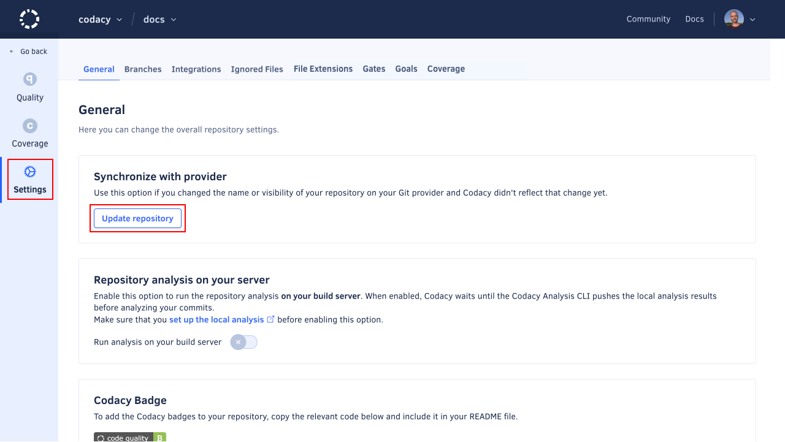

# I renamed my repository on the Git provider

If you changed the name or URL of your repository on your Git provider, you can update the name and URL of the repository on Codacy to point to the new location. This ensures that you won't lose historical data about your repository on Codacy.

To rename your repository on Codacy, open the page **Settings** and click the button **Update name**.

