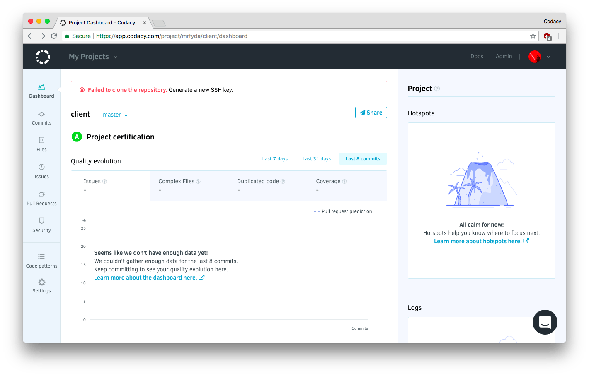
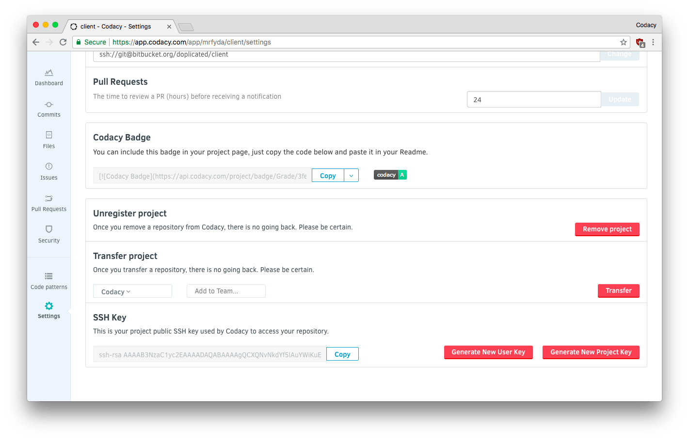

# Repository failed to clone? Generating a new SSH key

SSH keys are used for repository cloning and exclusively used for these repositories. Depending on the level of access the user configuring the repository on Codacy has on the remote git provider, the key can be added either directly to the repository itself, because the user has Write or Admin access; or to the user, with Read or Commit-only access.
For that reason, some changes on the remote git provider can cause Codacy to stop communicating with the repository.

-   Renaming the repository or moving to a different account:
    1.  In the Repository Settings view, update the git URL to match the new one
-   Removing access to the user that configured the repository on Codacy, if the key was added to its account:
    1.  In the Repository Settings view, recreate the integration with the remote git provider;
    2.  Then click "Generate New Repository key". See below for details.

**Generate New Repository Key** is the recommended option. It will add a new SSH key to your repository deployment keys. However, this is only possible if the user configuring the integration with the remote git provider has write/admin access. Otherwise, this operation will fail.
Alternatively, you can do this process manually by copying the SSH key.

**Generate New User Key **should only be used if [your repository is using submodules on Codacy](/hc/en-us/articles/360005239394-Submodules-how-to-enable-them-).
Adding the SSH key to your account allows Codacy to access the repository and all the submodules, without you adding the key to the repository and then having to copy it to all its submodules.
