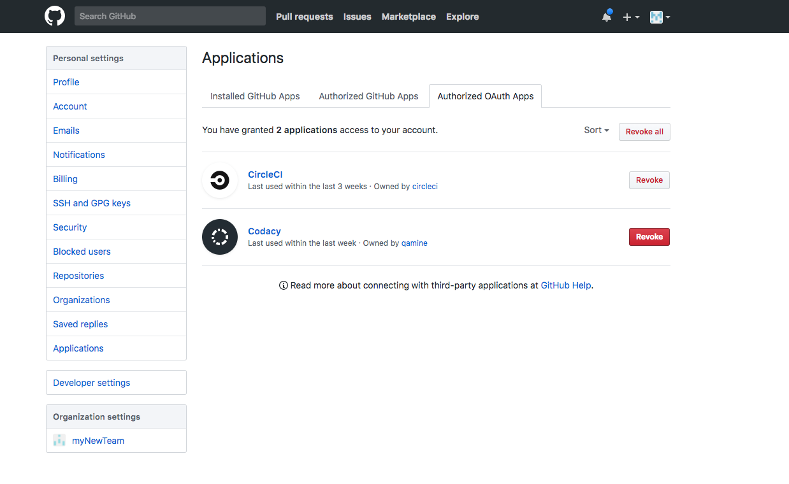

# Why can't I see or add my organization's repositories?

If you can't see or add your organization's repositories, or have any problems regarding metrics (for example, you can't see any issues and your pull requests aren't analyzed), please check if your user account has a duplicated copy of the repository on the organization.

The ideal scenario for your organization's repositories is to have a unique copy of it added to your Codacy organization, by someone with write permissions on the repository.

In case you have a duplicated repository on your account, please delete it and use only the one available in your organization.

In the unlikely event of not seeing repositories for one or multiple organizations, please go to your GitHub settings and revoke the Codacy OAuth application.

After revoking Codacy from the GitHub Authorized OAuth Apps, go back to Codacy and add a repository to see the **Authorize Codacy** menu. You may have to click **GitHub** on the sidebar to request Codacys's permission on GitHub's side.

Click "Grant" on each organization, to see their repositories on Codacy.

If this didn't solve your issue, be sure to also check out the following pages:

-   [I renamed my repository on the Git provider](i-renamed-my-repository-on-the-git-provider.md)
-   [I moved my repository on the Git provider](i-moved-my-repository-on-the-git-provider.md)
