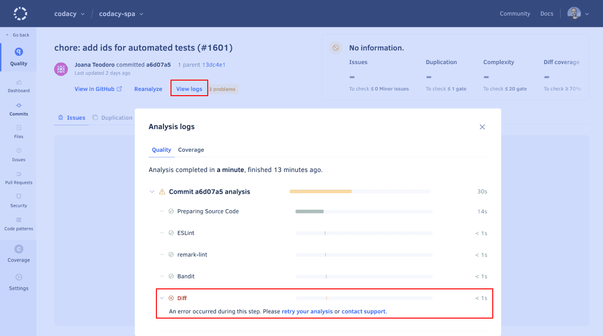

# Error caused by incompatible line endings

Codacy executes the `git diff` command when analyzing new commits and pull requests to identify the lines of code that were changed. Codacy then uses this information to display the issues that were caused by the changes introduced by the commits or pull requests.

If you have files in your repository that use the carriage return (CR) as the line end control character, the command `git diff` doesn't correctly identify line endings in the changed files. Because of this, Codacy is unable to use the output of the command and you'll see an error in the **Diff** step of your commit or pull request analysis logs:



The CR line end control character was used by older Classic Mac OS systems, and for the sake of interoperability it's recommended that you:

1.  Find the files in your repository that include CR line endings.

    !!! tip
        On *nix operating systems including macOS, you can use the command `file` to detect files in your repository that use CR line endings. For example, run the following command on the root of your repository:

        ```bash
        find . -type f -exec file {} \; | grep "CR line"
        ```

1.  Update the line endings in your source code files to use either the control characters:

    -   LF, if primarily using Unix-like systems such as Linux or the newer macOS operating system
    -   CRLF, if primarily using the Microsoft Windows operating system

    !!! tip
        [This article on Wikipedia](https://en.wikipedia.org/wiki/Newline#Conversion_between_newline_formats) includes examples on how to convert the line endings in your files.

1.  After converting the line endings in your source code files, you may also want to check the following resources for help on standardizing the line endings on your repositories and how to configure Git to correctly handle line endings:

    -   [What's the recommended way to store files in Git?](https://git-scm.com/docs/gitfaq#Documentation/gitfaq.txt-What8217stherecommendedwaytostorefilesinGit)
    -   [Customizing Git - Formatting and Whitespace](https://git-scm.com/book/en/Customizing-Git-Git-Configuration#_formatting_and_whitespace)
    -   [Configuring Git to handle line endings](https://docs.github.com/en/github/using-git/configuring-git-to-handle-line-endings)
    -   [Mind the End of Your Line](https://adaptivepatchwork.com/2012/03/01/mind-the-end-of-your-line/)
