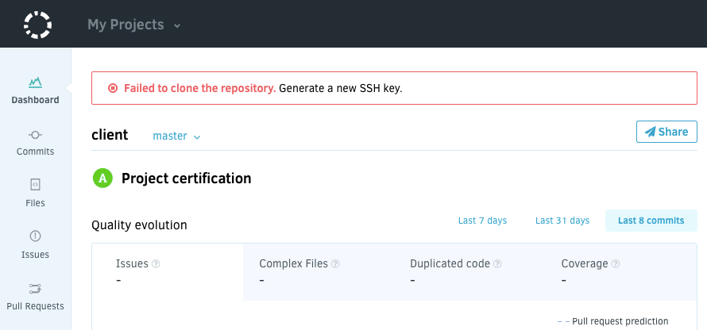
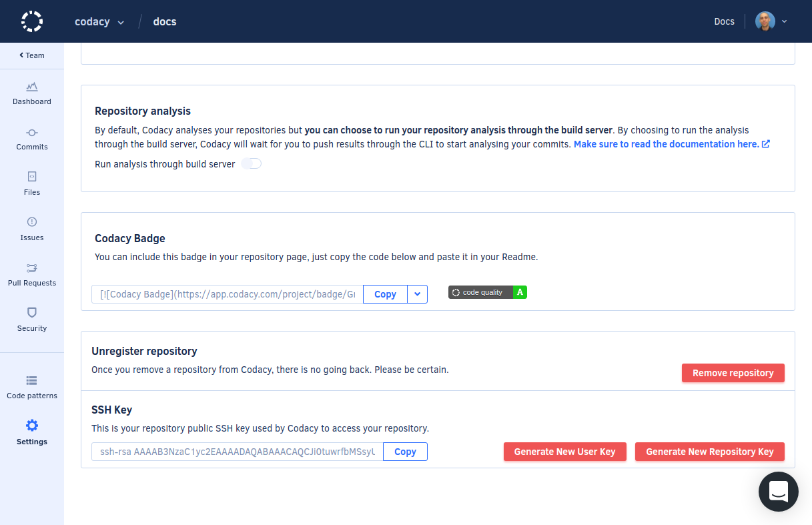

# Failed to clone the repository, generate a new SSH key

SSH keys are exclusively used for repository cloning.

Depending on the level of access that the user configuring the repository on Codacy has on the remote Git provider, the key can be added either:

-   Directly to the repository itself, because the user has Write or Admin access to the repository
-   To the user account, if the user only has Read or Commit-only access to the repository

For this reason, some changes on the remote Git provider can prevent Codacy from cloning the repository.

## The repository was renamed or moved

If you renamed the repository or moved it to a different account on the Git provider:

1.  On Codacy, open your **Repository Settings**, **General**
2.  Click the button **Update name**.

## The user that configured the repository no longer has access

If the user that initially configured the repository on Codacy was using a user account key but no longer has access to the repository on the Git provider:

1.  On Codacy, open your **Repository Settings**, **General**
2.  Click the button **Generate New Repository Key** (recommended) or **Generate New User Key**:

    **Generate New Repository Key** is the recommended option. It will add a new SSH key to your repository deployment keys. However, this is only possible if the user configuring the integration with the remote Git provider has Write or Admin access. Otherwise, this operation will fail. Alternatively, you can also do this process manually by copying the SSH key.

    **Generate New User Key** should only be used if [your repository is using submodules on Codacy](/hc/en-us/articles/360005239394-Submodules-how-to-enable-them-). Adding the SSH key to your user account allows Codacy to access the repository as well as all the submodules without having to create the key on all submodules.
    
    !!! important
        **If you're using Bitbucket Cloud**, you must manually add the SSH key on your [user account](https://bitbucket.org/account/settings/ssh-keys/).

