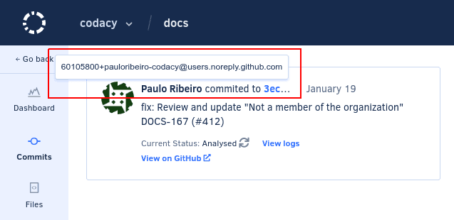
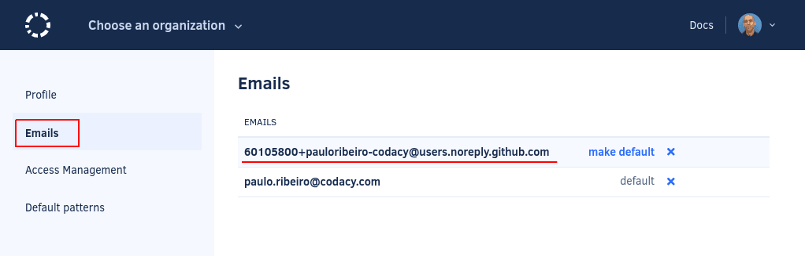

# Not a member of the organization



When you see the message **Not a member of the organization** it means that Codacy Cloud can't analyze a commit because the associated email address doesn't belong to any Codacy user.

You can check which email address is associated with a commit by hovering the cursor on the name of the contributor on the page for the commit:



To verify which email addresses are associated with the Codacy Cloud account, the user must click on their avatar on the top right-hand corner, select **Your account**, and open the page **Emails**:



There may be different reasons for this issue to happen:

-   **The user making the commit hasn't signed in to Codacy Cloud and joined the organization yet**

    The user must [join the organization](../../organizations/managing-people.md#joining) or, if you're the organization owner, you can [add the user](../../organizations/managing-people.md#adding-people) instead.

-   **The commit email address isn't associated with the account of a Codacy Cloud user**

    Codacy automatically associates the email addresses from the Git provider accounts to the Codacy accounts when users sign in to Codacy. Make sure that the user configures the missing email address on their Git provider account, and that the user logs in again on Codacy for the change to take effect.

-   **Git isn't configured with your correct email address**

    Unless you explicitly [configure your email address](https://git-scm.com/docs/git-config#Documentation/git-config.txt-useremail), Git automatically uses an email address based on the username and hostname of your workstation, and associates this email address with your commits.

    To check which email address your local Git installation is using, run the following command on your workstation:

    ```bash
    git config user.email
    ```

    If the returned email address isn't one of the email addresses associated with your Git provider account, configure Git to use one of those email addresses instead:

    ```bash
    git config --global user.email you@example.com
    ```

    !!! important
        Make sure that your email address doesn't include any extra characters such as quotes (`""` or `''`).

## See also

-   [How do I change my email address on Codacy?](../general/how-do-i-change-my-email-address-on-codacy.md)
