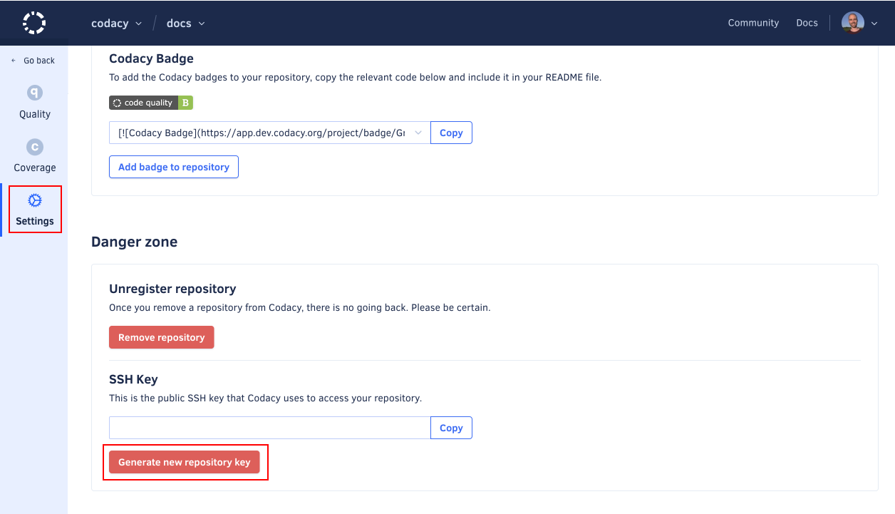

# We no longer have access to this repository, check your SSH keys

Some changes on your Git provider can prevent Codacy from cloning your private repository. When this happens, Codacy displays the error message "We no longer have access to this repository" on the Repository Dashboard page.

## The repository was renamed or moved

If you renamed the repository or moved it to a different account on the Git provider:

1.  On Codacy, open your **Repository Settings**, tab **General**.
1.  Click the button **Update repository** in the **Synchronize with provider** area.

## The user that configured the repository no longer has access

!!! info "This section applies only to GitLab and Bitbucket"

Codacy uses SSH keys to clone your private repositories. Depending on the level of access that the user configuring the repository on Codacy has on the remote Git provider, an SSH key can be added either:

-   Directly to the repository itself, if the user has permissions to add SSH keys to the repository
-   To the user account, if the user only has read or commit permissions on the repository

If the user that initially configured the repository on Codacy was using a user account SSH key but no longer has access to the repository on GitLab or Bitbucket:

1.  On Codacy, open your **Repository Settings**, tab **General**.
1.  Click the button **Generate New Repository Key** to add a new SSH key to your repository deployment keys.

    This is only possible if the user configuring the integration with the remote Git provider has administrator access to the repository. Otherwise, this operation will fail. Alternatively, you can do this process manually by copying the SSH key.

    !!! note
        If [your repository is using submodules on Codacy](../../repositories-configure/using-submodules.md), add a new SSH user key to your git provider account instead.

    <!--TODO PLUTO-630 Update screenshot-->

1.  Open the tab **Integrations**. If you have an integration with your Git provider enabled, [remove and re-create the integration](why-did-codacy-stop-commenting-on-pull-requests.md).
