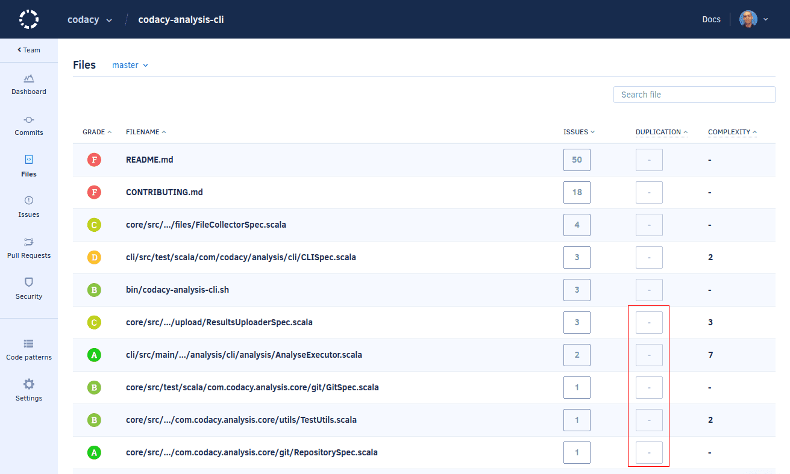
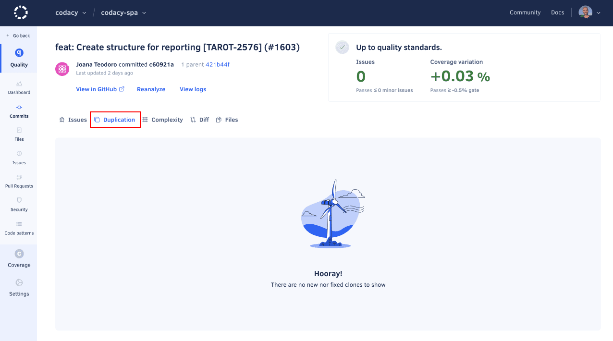

# Why aren't duplication metrics being calculated?

For performance reasons, Codacy skips the calculation of code duplication for programming languages that have more than 5000 source code files in a repository.

Besides this, if Codacy fails to calculate code duplication for a specific programming language in a repository three times in a row (for example, because the tool calculating the analysis runs out of memory or times out), Codacy stops trying to analyze the metric for that language and repository.

When this happens, Codacy does not display code duplication metrics for the affected language:

-   The **Files** page on your repository displays a blank duplication value for files of the affected language.

    

-   The **Commits** and **Pull Request** pages display an empty **New Duplication** tab.

    

-   The analysis logs for commits will not display a duplication analysis task for the tool corresponding to the affected language.

    

As a workaround, if you are exceeding the maximum number of source code files:

1.  We recommend that you use a [Codacy configuration file](../../repositories-configure/codacy-configuration-file.md) to exclude source code files of the affected language from your project to decrease the number of files to be analyzed.

    For example, you may be able to exclude files that are automatically generated from your test suite or files belonging to dependencies that are not maintained by your team, such as the `node_modules` folder for JavaScript projects.

2.  Reanalyze the last commit in the repository so that Codacy runs the code duplication analysis.

If the analysis finishes but the code duplication metric was not calculated, follow the next steps:

-   **If you are using Codacy Self-hosted**, open the **Admin panel**, **Repositories**, select the repository, tab **Settings**, and reset the code duplication analysis in **Duplication settings**. Then, reanalyze the last commit in the repository so that Codacy runs the code duplication analysis.

    

-   **If you are [analyzing your repository locally](../../related-tools/run-local-analysis.md)** with `codacy-analysis-cli`, consider using the flag `--tool-timeout` to specify a larger timeout for the execution of the tool.

-   **If you are using Codacy Cloud** or if the steps above did not solve the issue, contact <support@codacy.com>.
