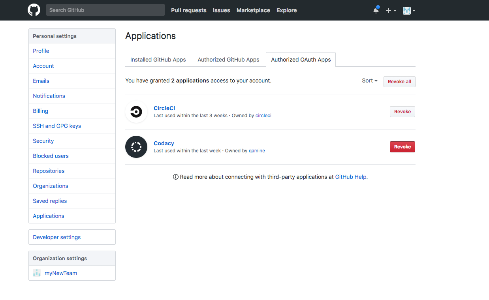

# Why can't I see or add my organization's repositories?

If you can't [see or add your repositories on your Codacy organization](../../organizations/managing-repositories.md), please go to your GitHub settings and revoke the Codacy OAuth application.

After revoking Codacy from the GitHub Authorized OAuth Apps, go back to Codacy and add a repository to see the **Authorize Codacy** menu. You may have to click **GitHub** on the sidebar to request Codacys's permission on GitHub's side.

Click "Grant" on each organization, to see their repositories on Codacy.

If this didn't solve your issue, be sure to also check out the following pages:

-   [I renamed my repository on the Git provider](../repositories/i-renamed-my-repository-on-the-git-provider.md)
-   [I moved my repository on the Git provider](../repositories/i-moved-my-repository-on-the-git-provider.md)
