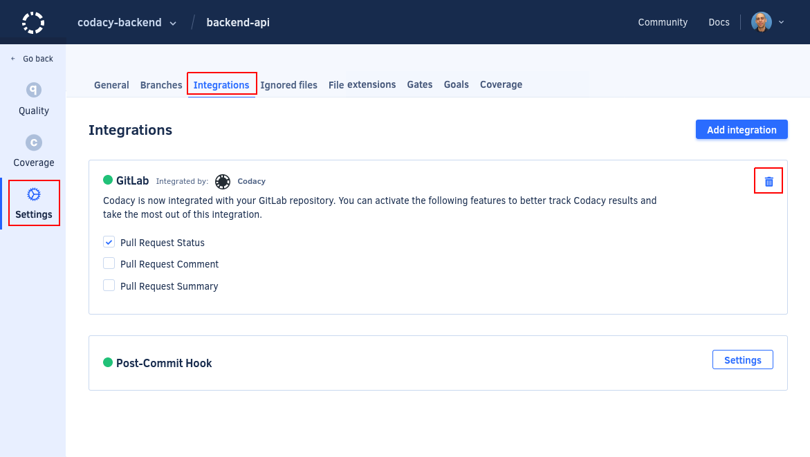

# Why did Codacy stop commenting on pull requests?

Different reasons can cause Codacy to stop commenting on pull requests, but the most common is that the user who initially enabled the Git provider integration no longer has permissions on the repository or that the SSH key is no longer valid.

To fix this issue, we recommend that a user **with administrator permissions on the repository** re-enables the Git provider integration on Codacy:

1.  Open your repository **Settings**, tab **Integrations**, and click the trash can icon to remove the existing Git provider integration:

    

1.  Re-enable the integration by following the instructions for your Git provider:

    -   [Enabling the GitHub integration](../../repositories-configure/integrations/github-integration.md#enabling)

    -   [Enabling the GitLab integration](../../repositories-configure/integrations/gitlab-integration.md#enabling)

    -   [Enabling the Bitbucket integration](../../repositories-configure/integrations/bitbucket-integration.md#enabling)

## See also

-   [We no longer have access to this repository, check your SSH keys](we-no-longer-have-access-to-this-repository.md)
