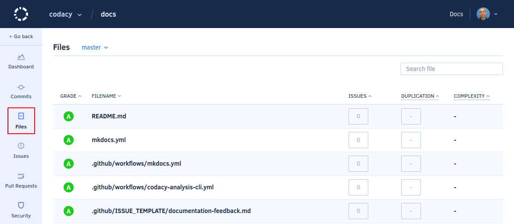

# Why is my file missing?

In your repository's **Files** page you can view all the files that Codacy detected in your repository:



While this page should display all the files in your repository, here is a list of reasons why some files might be missing:

-   **You are viewing the incorrect branch**

    On the **Files** page you can select which branch to display, and sometimes not all files exist in all branches.

-   **The file might have been ignored**

    The **Files** page doesn't display [ignored files](../../repositories-configure/ignore-files-from-codacy-analysis.md) that aren't meant to be analyzed.

-   **The file has an extension that is not on the list of supported extensions**

    Codacy has a default [list of file extensions](../../repositories-configure/file-extensions.md) that it associates to each language. Files with extensions that aren't on the list don't appear on the **Files** page.

-   **The file might be too big**

    Codacy only displays files up to 150 KB. Read the section below for more information.

## File size limitation on Codacy Cloud

Codacy Cloud currently doesn't analyze files that are above 150 KB in size. Larger files aren't displayed on Codacy nor taken into account when grading your repository.

### Why is there a limit?

As part of our performance improvement measures, we spent time breaking down the total time it takes to analyze a repository and found that a large percentage of time was spent on files that didn't add value to our users. Those files tend to be the biggest in the repository and are typically generated by or dependent on a third-party. It increased analysis time significantly due to the file size and even resulted in time-outs at some point, preventing the flagging of real issues.

As a solution to this problem, we placed a size limit to the files that Codacy would analyze. This decreased the average analysis time and the number of timeouts, thus improving the overall performance for our users.

### What if I need to analyze a file that exceeds this limit?

While Codacy will discard your file by default, you can still have it analyzed using the [Codacy Analysis CLI](../../related-tools/local-analysis/running-local-analysis.md) and running the analysis locally. CLI doesn't have a set timeout or any limitation on file size, so you will be able to have your files analyzed this way.

### What about Codacy Self-hosted?

By default, Codacy Self-hosted has the same limit of 150 KB as Codacy Cloud. However, the limit is configurable because the resource allocation for on-premise instances is decided by each organization.

To update the file size limit:

1.  Edit the value of `global.workerManager.workers.config.analysis.maxFileSizeBytes` in the `values-production.yaml` file that you used to install Codacy:

    ```yaml
    global:
      workerManager:
        workers:
          config:
            analysis:
              maxFileSizeBytes: 150000
    ```

1.  Apply the new configuration by performing a Helm upgrade and specifying the Codacy Self-hosted version currently installed. To do so execute the command [used to install Codacy](../../chart/index.md#helm-upgrade):

    !!! important
        **If you are using MicroK8s** you must use the file `values-microk8s.yaml` together with the file `values-production.yaml`.

        To do this, uncomment the last line before running the `helm upgrade` command below.

    ```bash
    helm upgrade (...options used to install Codacy...) \
                 --version <current Codacy Self-hosted version> \
                 --values values-production.yaml \
                 # --values values-microk8s.yaml
    ```

