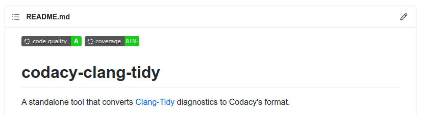

# Adding a Codacy badge to your repository

Add a Codacy badge to the README of your repository to display the current code quality grade or code coverage of your code.



To obtain your Codacy badge, open your repository **Settings**, tab **General**, select the markup language, and copy the generated code to your README file. You can also add a badge for your coverage if you have [set up code coverage](../coverage-reporter/index.md) for your repository.


To display the grade or code coverage information of a [different branch](../repositories-configure/managing-branches.md) analyzed by Codacy, append `?branch=<branch_name>` to the URL of the badge. For example:

```text
https://app.codacy.com/project/badge/Grade/cba8fd0874ac4f569f4f880e473cbac9?branch=dev
```
