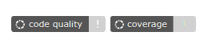

# Adding a Codacy badge

Add a Codacy badge to the README of your repository to display the current code quality grade or code coverage of your code.


To obtain your Codacy badge, open your repository **Settings**, tab **General**, select the markup language, and copy the generated code to your README file. You can also add a badge for your coverage if you have [set up code coverage](../coverage-reporter/index.md) for your repository.


To display the grade or code coverage information of a [different branch](../repositories-configure/managing-branches.md) analyzed by Codacy, append `?branch=<branch_name>` to the URL of the badge. For example:

```text
https://app.codacy.com/project/badge/Grade/cba8fd0874ac4f569f4f880e473cbac9?branch=dev
```

## Fixing your Codacy badge

The Codacy badges for your repository may become unavailable or grayed out if the analysis or code coverage information for the last commit isn't available, or if you renamed or re-added your repository on Codacy:



To fix each badge:

-   [Reanalyze the branch](../faq/repositories/how-do-i-reanalyze-my-repository.md#reanalyzing-a-branch) associated with the **code quality badge**
-   Make sure that you're [generating and uploading code coverage reports](../../coverage-reporter/) for all the commits in the branch associated with the **coverage badge**

If these steps don't fix your Codacy badges it can mean that the badges are no longer valid. In this case, [repeat the steps above](#adding-a-codacy-badge) to replace the existing badges with new ones.
