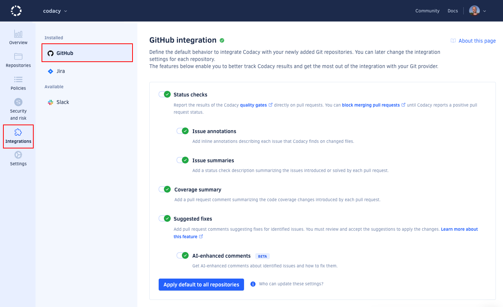

# Configuring your organization



Now that you are familiar with Codacy, you might want to configure your Codacy organization to align with your corporate policies and ensure consistent code quality across your repositories.

To configure your organization, follow these steps:

1.  [Configuring repository management permissions](#repository-permissions)
1.  [Assigning organization manager role](#org-manager)
1.  [Defining gate policies](#gate-policies)
1.  [Defining coding standards](#coding-standards)
1.  [Configuring default Git provider integration settings](#git-provider-settings)

## 1. Configuring repository management permissions {: id="repository-permissions"}

[Define the Codacy roles](../organizations/roles-and-permissions-for-organizations.md#change-analysis-configuration) that can configure patterns, analyzed languages and branches, ignore issues and files, and reanalyze branches and pull requests.

## 2. Assigning the organization manager role {: id="org-manager"}

[Assign the organization manager role](../organizations/roles-and-permissions-for-organizations.md#managing-the-organization-manager-role) to members of your organization to grant them additional permissions without changing their permissions on the Git provider. For example, they will be able to manage your organization policies and integrations.

## 3. Defining gate policies {: id="gate-policies"}

[Define gate policies](../organizations/using-gate-policies.md) to ensure that Codacy uses the same quality gates across your organization repositories.

## 4. Defining coding standards {: id="coding-standards"}

[Define coding standards](../organizations/using-coding-standards.md) to ensure that multiple repositories consistently follow the same global tool and code pattern configurations.

## 5. Configuring default Git provider integration settings {: id="git-provider-settings"}

[Configure the default settings that Codacy uses to integrate with your Git provider](../organizations/integrations/default-git-provider-integration-settings.md) when you add a new repository to Codacy. This enables you to apply the same settings across your organization repositories.

## Next steps {: id="next-steps"}

Now that you set up the global settings for your organization, see how to [configure any specific settings for each repository](./configuring-your-repository.md).
