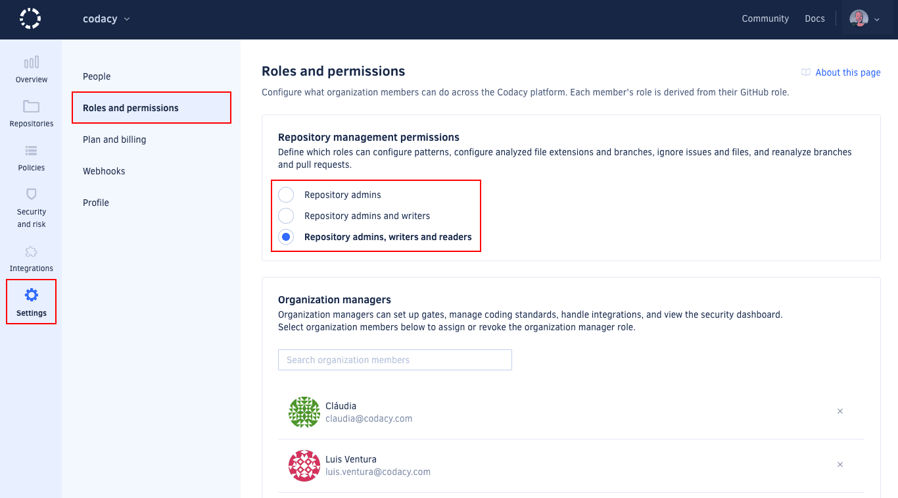

# Configuring your organization



Once you've added your organization to Codacy, it's important that you align it with your corporate policies and ensure consistent code quality across your repositories.

To configure your organization, follow these steps:

1.  [Configuring repository management permissions](#repository-permissions)
1.  [Assigning organization manager role](#org-manager)
1.  [Defining gate policies](#gate-policies)
1.  [Defining coding standards](#coding-standards)
1.  [Configuring default Git provider integration settings](#git-provider-settings)
1.  [Adding repositories](#adding-repositories)

## 1. Configuring repository management permissions {: id="repository-permissions"}

[Define the Codacy roles](../organizations/roles-and-permissions-for-organizations.md#change-analysis-configuration) that can configure patterns, analyzed languages and branches, ignore issues and files, and reanalyze branches and pull requests.

## 2. Assigning the organization manager role {: id="org-manager"}

[Assign the organization manager role](../organizations/roles-and-permissions-for-organizations.md#managing-the-organization-manager-role) to members of your organization to grant them additional permissions without changing their permissions on the Git provider. For example, they will be able to manage your organization policies and integrations.

## 3. Defining gate policies {: id="gate-policies"}

[Define gate policies](../organizations/using-gate-policies.md) to ensure that Codacy uses the same quality gates across your organization repositories.

## 4. Defining coding standards {: id="coding-standards"}

[Define coding standards](../organizations/using-coding-standards.md) to ensure that multiple repositories consistently follow the same global tool and code pattern configurations.

## 5. Configuring default Git provider integration settings {: id="git-provider-settings"}

[Configure the default settings that Codacy uses to integrate with your Git provider](../organizations/integrations/default-git-provider-integration-settings.md) when you add a new repository to Codacy. This enables you to apply the same settings across your organization repositories.

## 6. Adding repositories {: id="adding-repositories"}

Next, add the repositories that you wish to analyze. Codacy begins an initial analysis as soon as you add a repository and sets everything up to ensure your next commits on that repository are analyzed.

!!! note
    You can only add repositories on Codacy if you have the [necessary permissions on your Git provider](../organizations/roles-and-permissions-for-organizations.md).

Click the repository name to navigate to the repository dashboard and see the [code quality overview of your repository](../repositories/repository-dashboard.md) as soon as the initial analysis is complete:

To explore the initial analysis results, [check the **Issues** page](../repositories/issues.md).

## Next steps {: id="next-steps"}

The first analysis is based on the organization policies and standards that you previously defined, or Codacy defaults if you haven't defined your own policies. It's now important that you [configure specific rules for each repository](configuring-your-repository.md) to integrate code analysis seamlessly into your existing pipeline.
