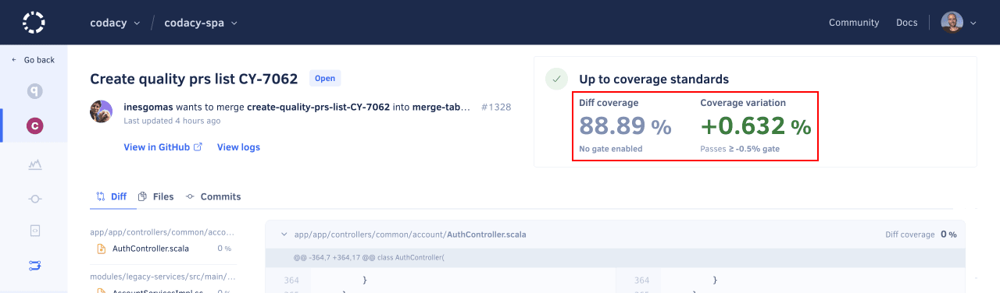

# Configuring your repository

<!--TODO
    - Review the intro and consider integrating the remaining info gathered from previous versions

We recommend that you spend some time reviewing the Codacy analysis settings to focus on the tools and code patterns that bring more value to your team. Importantly, this eliminates the risk of having false positives block the work of your team once you start using Codacy as a quality gate.
-->

Once you've [added your first repository](codacy-quickstart.md), it's important that you configure the analysis tools to match the use cases of your team, enforce or promote any coding conventions and best practices that your team may already be following, and avoid time-consuming false positives.

You can optionally add coverage reports to detail how much of your code is covered by tests and unify your quality and coverage pipelines. You can generate coverage reports and upload them to Codacy using a range of options, such as CI/CD integration, CLI, Docker, GitHub action, and more.

To configure your repository, follow these steps:

1.  [Ignoring files](#ignoring-files)
1.  [Configuring code patterns](#configuring-code-patterns)
1.  [Adding coverage reports](#adding-coverage) (optional)

## 1. Ignoring files {: id="ignoring-files"}

[Ignore any files and directories](../repositories-configure/ignoring-files.md) that aren't relevant for the Codacy analysis, such as generated code or any third-party libraries included in your repositories.

## 2. Configuring code patterns {: id="configuring-code-patterns"}

[Configure the tools and code patterns](../repositories-configure/configuring-code-patterns.md) that Codacy uses to analyze your repository.

!!! tip
    To ensure that multiple repositories consistently follow the same global tool and code pattern configurations, [use an organization coding standard](../organizations/using-a-coding-standard.md) instead.

## 3. Adding coverage to your repository (optional) {: id="adding-coverage"}

If you want to use code coverage to block merging pull requests that don't meet your quality standards, make sure that you [add coverage to your repository](../coverage-reporter/index.md).

It's important that you set up coverage beforehand because Codacy can only report the coverage status for pull requests after receiving reports for the last commits **on both the pull request branch and the target branch**.

## Next steps {: id="next-steps"}

Once you’re satisfied with your setup, [integrate Codacy with your Git workflow](integrating-codacy-with-your-git-workflow.md) to flag potential issues, block problematic pull requests, and display other useful suggestions directly on your Git provider.

!!! tip
    To showcase the current code quality grade and coverage, [add a Codacy badge to your repository](adding-a-codacy-badge.md).
