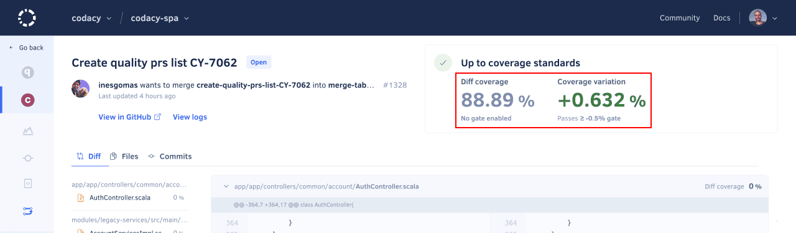

# Configuring your repository

<!--TODO Add the intro-->

## 1. Reviewing and adjusting the Codacy analysis settings {: id="adjusting-analysis-settings"}

We recommend that you spend some time reviewing the Codacy analysis settings to focus on the tools and code patterns that bring more value to your team. Importantly, this eliminates the risk of having false positives block the work of your team once you start using Codacy as a quality gate.

1.  [Ignore any files and directories](../../repositories-configure/ignoring-files.md) that aren't relevant for the Codacy analysis, such as generated code or any third-party libraries included in your repositories.

    

1.  [Configure the tools and code patterns](../../repositories-configure/configuring-code-patterns.md) that Codacy uses to analyze your repository.

    !!! tip
        To ensure that multiple repositories consistently follow the same global tool and code pattern configurations, [use an organization coding standard](../../organizations/using-a-coding-standard.md) instead.

    

## 2. Adding coverage to your repository (optional) {: id="adding-coverage"}

If you want to use code coverage to block merging pull requests that don't meet your quality standards, make sure that you [add coverage to your repository](../../coverage-reporter/index.md).

It's important that you set up coverage beforehand because Codacy can only report the coverage status for pull requests after receiving reports for the last commits **on both the pull request branch and the target branch**.

## Next steps {: id="next-steps"}

Once you’re satisfied with your setup, [integrate Codacy with your Git workflow](integrating-codacy-with-your-git-workflow.md) to flag potential issues, block problematic pull requests, and display other useful suggestions directly on your Git provider.

!!! tip
    To showcase the current code quality grade and coverage, [add a Codacy badge to your repository](adding-a-codacy-badge.md).