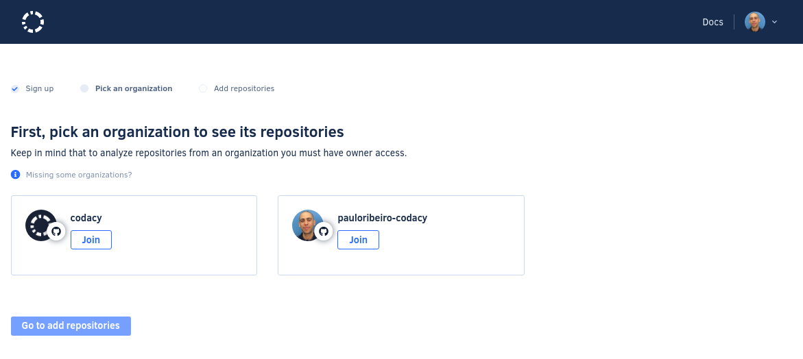
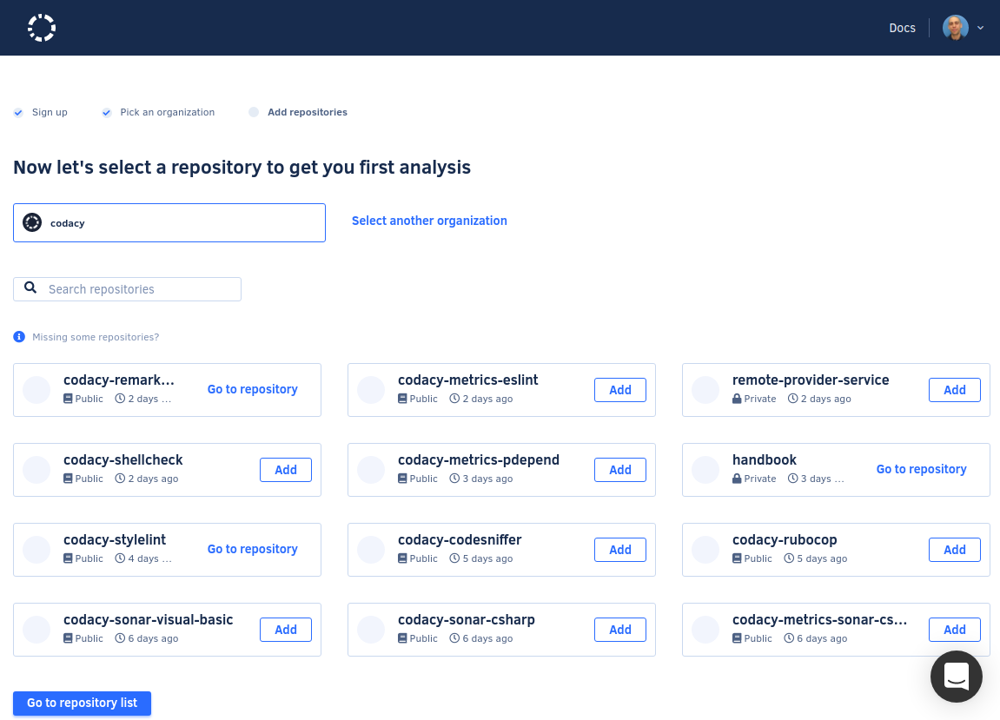

# Getting started with Codacy

Codacy automatically analyzes your code and identifies issues as you go, helping you code more efficiently with fewer issues down the line. Through static code review analysis, we notify you on security issues, code coverage, code duplication, and code complexity in every commit and pull request.

To get started, head to [codacy.com](https://www.codacy.com/) and click **Get started**.

## 1. Sign up {: id="sign-up"}

Sign up with a Git provider such as GitHub, GitLab, or Bitbucket. This links your Codacy user with your Git provider user, making it easier to add repositories to Codacy and invite your teammates.

Codacy will request access to your Git provider during the authorization flow. [Check the permissions that Codacy requires and why](which-permissions-does-codacy-need-from-my-account.md). Codacy will also ask you to fill in a few details about your company so we know a bit more about your use case.

## 2. Choose an organization {: id="choose-organization"}

Now, you'll need to join one or more organizations that contain your repositories. Your personal repositories are found in the organization with the same name as your Git provider username. The selected organizations will then be synced with Codacy so that managing your team permissions is easy. Read more about [what synced organizations do](../organizations/what-are-synced-organizations.md). 

!!! tip
    If you can't see the organization you are looking for, [follow these troubleshooting instructions](../faq/general/why-cant-i-see-my-organization.md).

To start adding your repositories, select one of the organizations and click **Go to add repositories**.

## 3. Add repositories {: id="add-repositories"}

As a final step, add the repositories that you wish to analyze. Codacy will start the first analysis and set up everything required to ensure your next commits on those repositories are analyzed.

!!! tip
    You can only add repositories on Codacy if you have the [necessary permissions on your Git provider](../organizations/roles-and-permissions-for-synced-organizations.md).

Codacy begins an initial analysis as soon as you add a repository, and displays an overview of the code quality of your repository when the analysis is complete.

## 4. Tweak your repository settings {: id="tweak-settings"}

 [Check the static analysis results](../repositories/issues-view.md) on the "Issues" page to explore the initial analysis results.
 
 The first analysis is based on Codacy **default configurations**, so you should tweak and adapt the following configurations to match your preferences and specific scenario:

-   [Ignore files](../repositories-configure/ignoring-files.md) that you want to exclude from the Codacy analysis.
-   [Configure the code patterns](../repositories-configure/code-patterns.md) that Codacy uses to analyze your repository.
-   [Configure your quality settings](../repositories/quality-settings.md) for pull requests.

## You're all set! 🎉 {: id="all-set"}

Congratulations, your new repository is ready!

Optionally, you can also:

-   [Add a Codacy badge to your repository](../repositories/badges.md) displaying the current code quality grade or code coverage.
-   [Add coverage reports to Codacy](../coverage-reporter/adding-coverage-to-your-repository.md).
