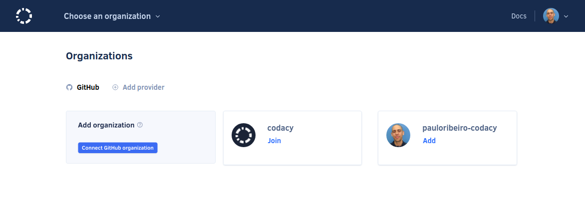
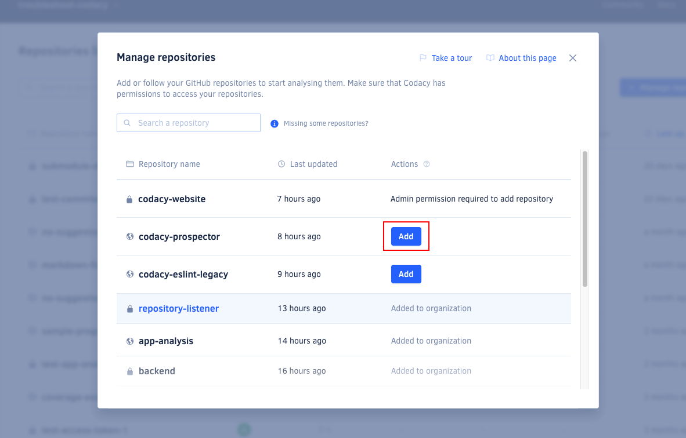
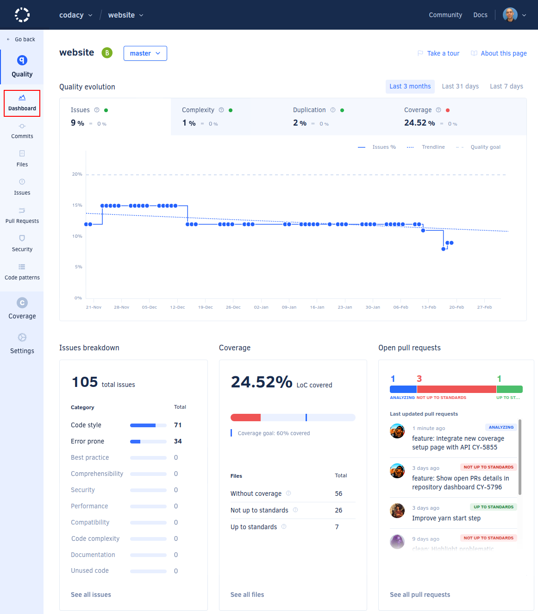

# Getting started with Codacy

Codacy automatically analyzes your source code and identifies issues as you go, helping you develop software more efficiently with fewer issues down the line. Through static code review analysis, Codacy notifies you of security issues, code coverage, code duplication, and code complexity in every commit and pull request.

To get started, head to [codacy.com](https://www.codacy.com/) and click **Get started**.

## 1. Sign up {: id="sign-up"}

Sign up with a Git provider such as GitHub, GitLab, or Bitbucket. This links your Codacy user with your Git provider user, making it easier to add repositories to Codacy and invite your teammates.

Codacy will request access to your Git provider during the authorization flow. [Check the permissions that Codacy requires and why](which-permissions-does-codacy-need-from-my-account.md). Codacy will also ask you to fill in a few details about your company so we know a bit more about your use case.

## 2. Choose an organization {: id="choose-organization"}

Now, you'll need to add or join the organizations that contain your repositories. The organization with the same name as your Git provider username contains your personal repositories. Read more about [organizations on Codacy](../organizations/what-are-synced-organizations.md).

  

To start adding your repositories, select one of the organizations.

!!! note
    If you can't see the organization you're looking for, [follow these troubleshooting instructions](../faq/general/why-cant-i-see-my-organization.md).

## 3. Add repositories {: id="add-repositories"}

Next, add the repositories that you wish to analyze. Codacy begins an initial analysis as soon as you add a repository and sets everything up to ensure your next commits on that repository are analyzed.

!!! note
    You can only add repositories on Codacy if you have the [necessary permissions on your Git provider](../organizations/roles-and-permissions-for-synced-organizations.md).

Click the link **Go to repository** to see the [code quality overview of your repository](../repositories/repository-dashboard.md) as soon as the initial analysis is complete:

## 4. Tweak your repository settings {: id="tweak-settings"}

 Check the static analysis results on the **Issues** page to [explore the initial analysis results](../repositories/issues.md).
 
 The first analysis is based on Codacy **default configurations**, so you should tweak and adapt the following configurations to match your preferences and specific scenario:

-   [Ignore files](../repositories-configure/ignoring-files.md) that you want to exclude from the Codacy analysis
-   [Configure the code patterns](../repositories-configure/code-patterns.md) that Codacy uses to analyze your repository
-   [Configure your quality settings](../repositories-configure/quality-settings.md) for pull requests

## You're all set! 🎉 {: id="all-set"}

Congratulations, your new repository is ready!

Optionally, you can also:

-   [Add coverage reports to Codacy](../coverage-reporter/index.md)
-   [Add a Codacy badge to your repository](adding-a-codacy-badge.md) displaying the current code quality grade or code coverage
