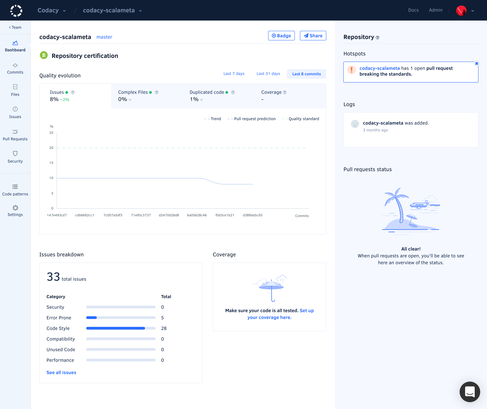

# I added a repository. Now what?

Codacy begins an initial analysis as soon as you add a repository and sends you an email notification once the first analysis is completed.

After the first analysis is complete you can continue to explore and configure Codacy for your repository:

-   Check the [Issues page](../repositories/issues-view.md) for the static analysis results
-   Read about [configuring Code patterns](../repositories-configure/code-patterns.md)
-   [Configure your Quality Settings](../repositories/quality-settings.md) for Pull Requests
-   Discover how you can [add coverage reports to Codacy](../repositories-configure/add-coverage-to-your-repo.md)
-   [Add a Codacy configuration file to your repository](../repositories-configure/codacy-configuration-file.md) and version your configurations
