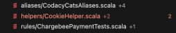
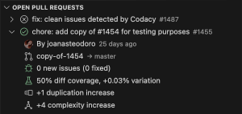
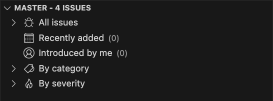

# Integrating Codacy with Visual Studio Code

The [Codacy Visual Studio Code extension](https://github.com/codacy/codacy-vscode-extension) is an open-source project that enables developers to review directly in VS Code the result of Codacy analysis for the pull requests they’re working on.

Use this extension to get the full list of problems found by Codacy for a pull request and navigate to any Quality issue that you want to review and fix.

!!! info "To use this extension you need a [Codacy account](https://www.codacy.com/signup-codacy)"

## Interface overview

The main view of the extension displays information about the code quality and coverage changes introduced by the pull requests you're working on, as well as the quality status of analyzed branches. This information is grouped into three panels:

-   [Pull request status](#status-tab)
-   [Open pull requests](#open-pull-requests-tab)
-   [Analyzed branch](#analyzed-branch-tab)

### Status tab

The **Pull request status** tab displays the following information for the pull request of the currently checked-out branch:

-   The **Quality status** of the pull request, either up to standards or not up to standards, based on the [Quality gates](../repositories-configure/adjusting-quality-gates.md) set for the repository.

-   Any **Quality issues** introduced or fixed by the pull request. These are the same issues you find in the [Quality Issues tabs](../repositories/pull-requests.md#issues-tab) in the Codacy app and are also visible in VS Code's Problems tab.

    The number next to each file name is the total number of Quality issues that the pull request adds to or removes from that file. The number farther to the right, added by VS Code, is the total number of problems in that file, which may or may not be Quality issues from Codacy. If there are any Medium or Critical Quality issues, the file name is also highlighted in yellow (Medium) or red (Critical).

    

-   The **diff coverage and coverage variation** introduced by the pull request. These are the same values you find in the [Pull request coverage overview](../repositories-coverage/pull-requests.md#coverage-overview) panel in the Codacy app.

    The percentage next to each file name is the coverage variation for that file.

-   Sequences of **duplicate code** (clones) introduced by the pull request. These are the same ones you find in the [Quality Duplication tabs](../repositories/pull-requests.md#duplication-tab) in the Codacy app.

-   Variations in **code complexity** introduced by the pull request.

### Open pull requests tab

The **Open Pull Requests** tab lists all open pull requests for the repository, including the following information for each:

-   The status of the pull request, which is visible on hover:

    -   Analyzing, if Codacy is analyzing the branch.

    -   Up to standards or not up to standards, based on the [Quality gates](../repositories-configure/adjusting-quality-gates.md) set for the repository.

-   The author of the pull request.

-   The source and target branches of the pull request.

-   Any **Quality issues** introduced or fixed by the pull request. These are the same issues you find in the [Quality Issues tabs](../repositories/pull-requests.md#issues-tab) in the Codacy app.

-   Sequences of **duplicate code** (clones) introduced by the pull request. These are the same ones you find in the [Quality Duplication tabs](../repositories/pull-requests.md#duplication-tab) in the Codacy app.

-   Variations in **code complexity** introduced by the pull request. This is the same value you find on the [Pull request quality overview](../repositories/pull-requests.md#quality-overview) in the Codacy app.

### Analyzed branch tab

The **Analyzed Branch** tab appears if you switch to an analyzed branch that doesn't have an open pull request, such as the `main` or `master` branch. This tab shows an overview of the Quality issues found in that branch, grouped by recently added, introduced by the current user, issue category, and issue severity.

See [how to manage the analysis of your repository's branches](../repositories-configure/managing-branches.md).

## Installing the Codacy VS Code extension

1.  Make sure that the repository you’re working on is analyzed by Codacy and that you have a [repository read](../organizations/roles-and-permissions-for-organizations.md) role or higher.

    !!! tip
        If this is your first time using Codacy, see [how to add and analyze your first repository](./codacy-quickstart.md#adding-your-first-repository).

1.  Install the extension from the [Visual Studio Marketplace](https://marketplace.visualstudio.com/items?itemName=codacy-app.codacy) or through the [Extensions view in VS Code](https://code.visualstudio.com/docs/editor/extension-marketplace#_browse-for-extensions).

    Alternatively, you can install it manually by [downloading the latest release as a VSIX package](https://github.com/codacy/codacy-vscode-extension/releases).

## Getting pull request quality and coverage data

To see Codacy quality and coverage data for an open pull request, follow these steps:

1.  Open the repository directory in VS Code.

    !!! note
        If the repository isn't on Codacy yet, [add it to Codacy](../organizations/managing-repositories.md#adding-a-repository) first.

1.  Open the main view by clicking the **Codacy logo** in the activity bar or the **Codacy tab** in the status bar.

    

1.  If you’re not signed in, click the **Sign in** button to authorize VS Code on Codacy.

    !!! tip
        To access a complete list of Codacy commands, open the VS Code command palette (`Ctrl+Shift+P` on Windows/Linux or `Cmd+Shift+P` on macOS) and type "Codacy".

1.  Check out the pull request of interest. You can do it either manually or from the **Open Pull Requests** tab, by clicking the arrow button or using the contextual right-click menu.

After completing these steps, the main view shows the result of the latest Codacy analysis for the pull request. The VS Code Problems tab lists the Quality issues found.

## Reviewing pull request issues

In the **Problems tab**, Codacy displays the same Quality issues you find in the **Status tab** and lets you navigate to the exact line of code where the issue was found.

!!! note
    Code coverage, duplicates, and complexity aren't currently shown in the Problems tab.

To review Quality issues:

1.  Open the **Problems tab** (use `Ctrl+Shift+M` on Windows/Linux or `Cmd+Shift+M` on macOS).

1.  Click the name of the issue you want to review.

    

1.  Hover over a highlighted issue in the code editor to view available actions and suggested quick fixes (if available).

    For a list of tools that support quick fixes, see [Supported languages and tools](./supported-languages-and-tools.md#supported-languages-and-tools).

1.  Once you've addressed the problems in your code, push your changes to the Git provider so that Codacy analyzes the updated code.

When the analysis is complete, the Codacy extension automatically refreshes the pull request analysis result. You can also refresh the pull request data manually by clicking the Refresh Pull Request button in the main view.

## See also

-   [Troubleshooting the Codacy VS Code extension](https://github.com/codacy/codacy-vscode-extension#troubleshooting)
